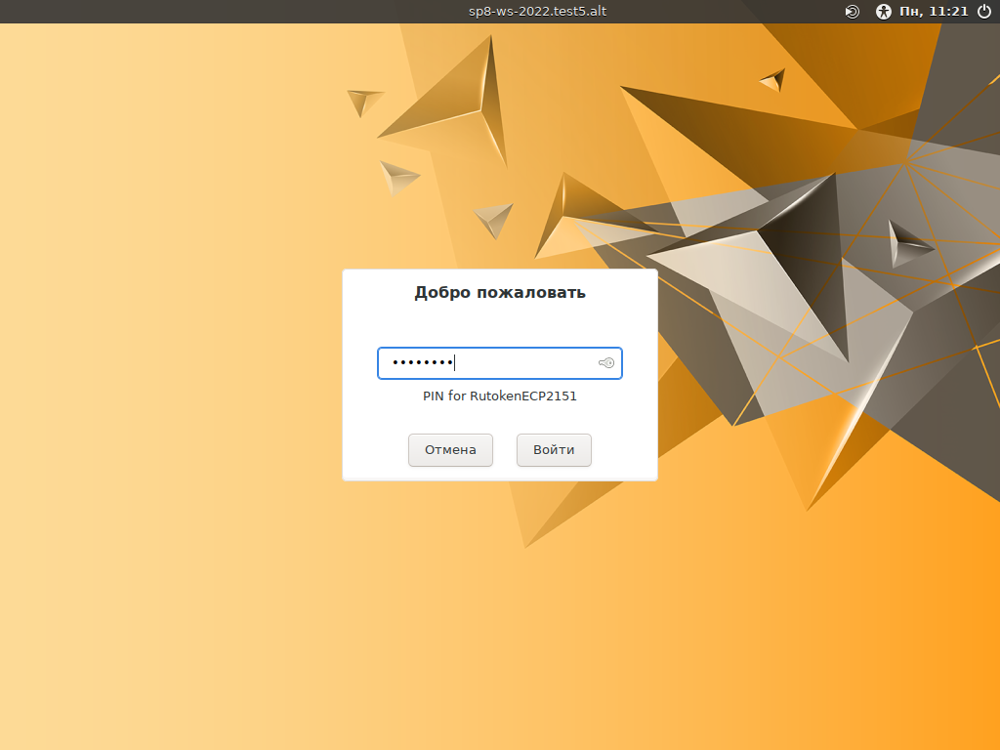
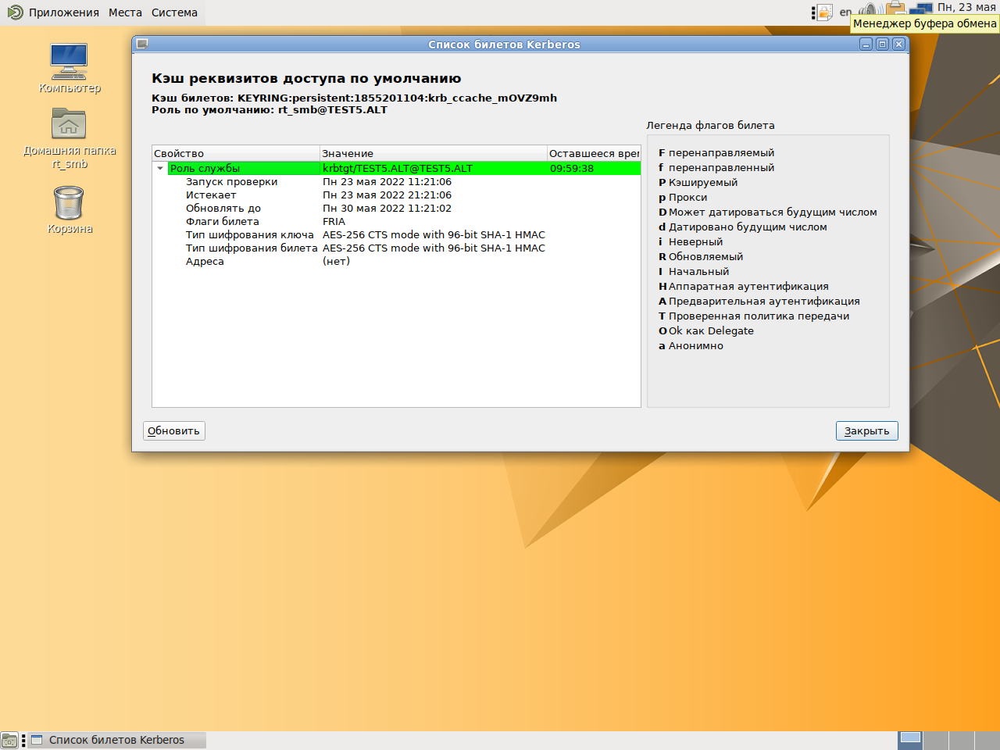
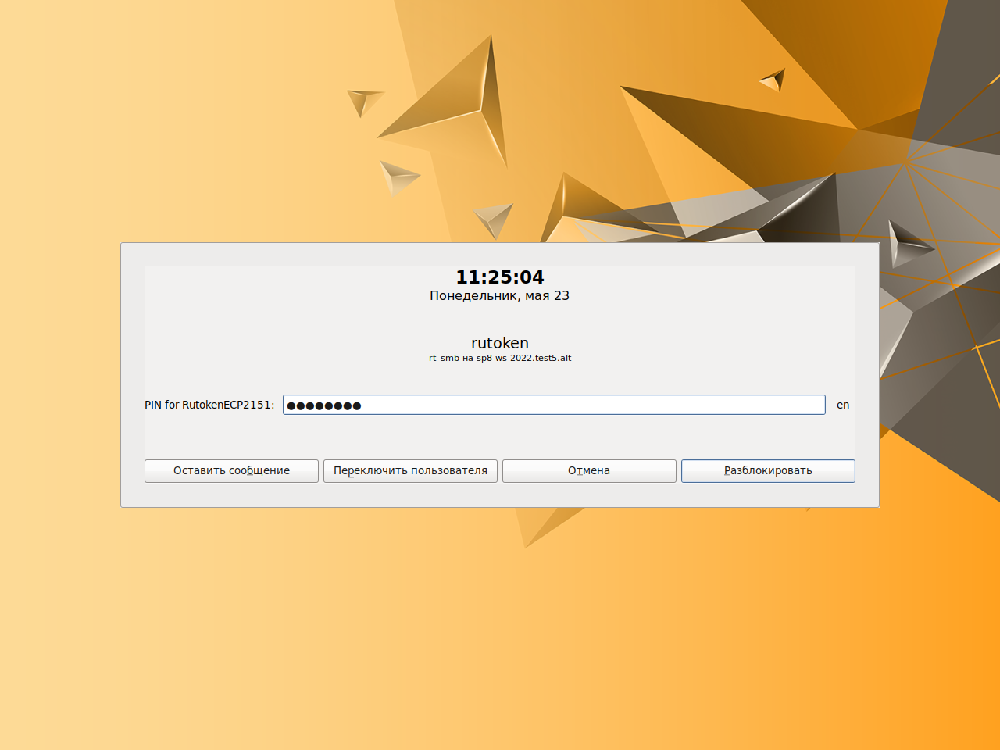
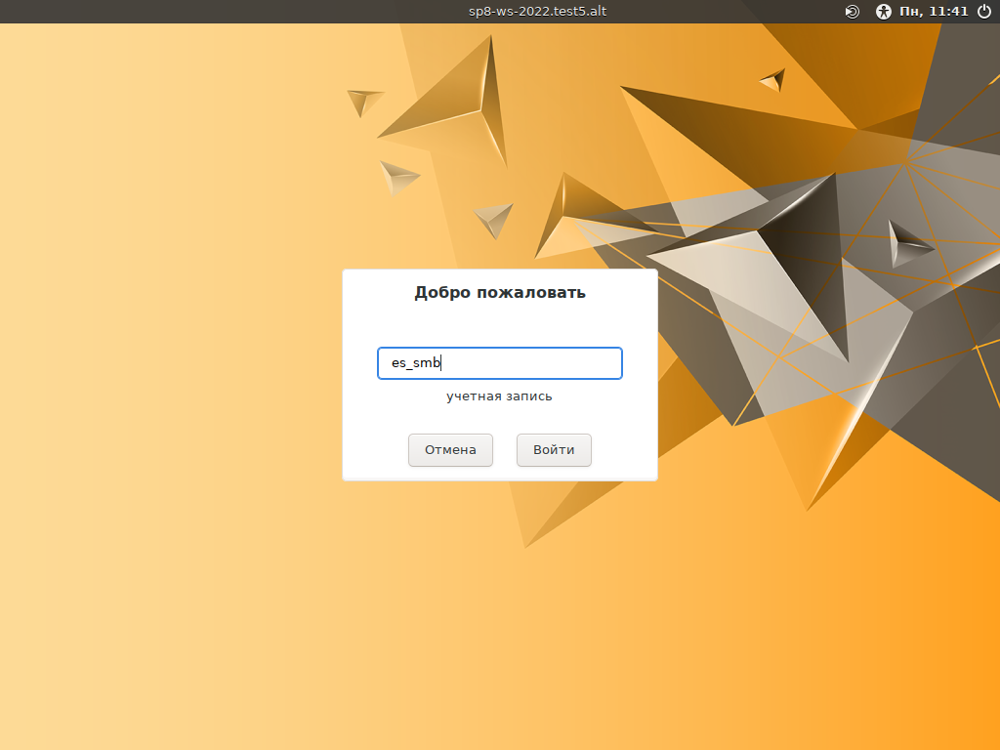
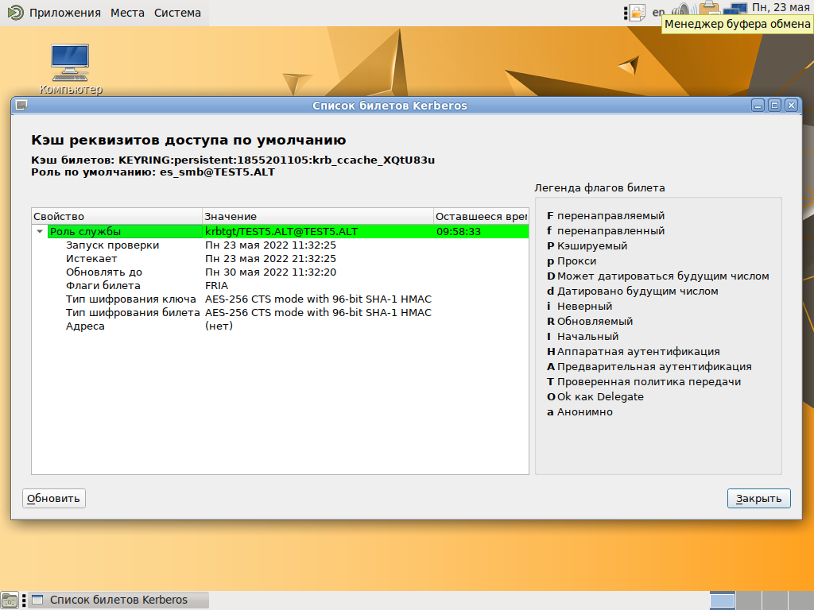
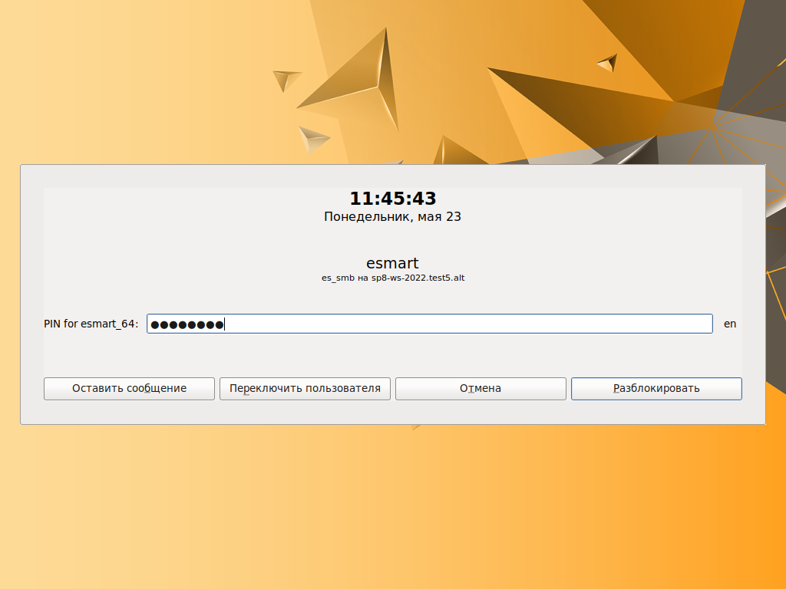
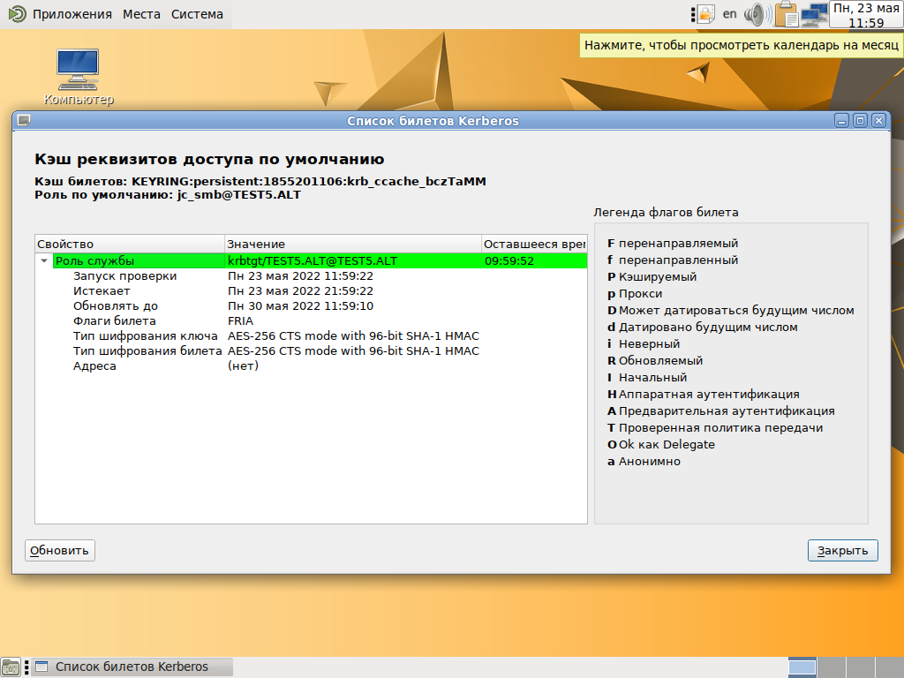
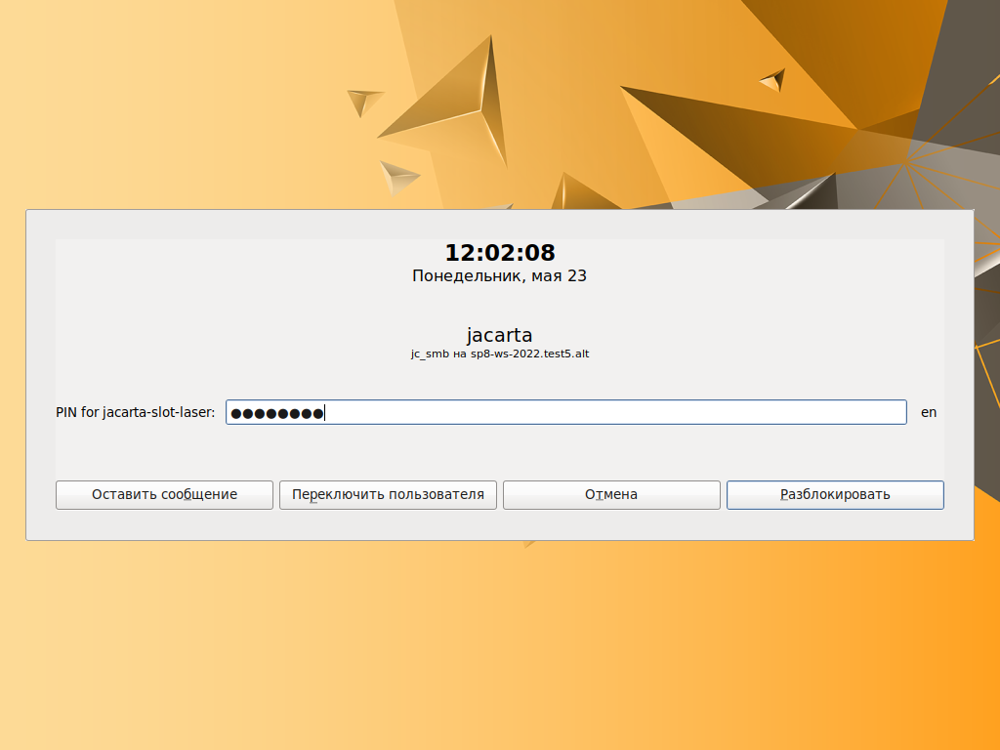

= Настройка двухфакторной аутентификации в домене Samba AD
:authors: Служба обеспечения совместимости <gost@basealt.ru>,  Константин Белаш
:doctype: book
:revdate: 24.05.2022
:revnumber: 1.0
:chapter-signifier: #
:toc:
:toc-title: Оглавление
:toclevels: 5
:sectnums:
:sectnumlevels: 5
:icons: font

== Общая информация

Двухфакторная аутентификация (2ФА, 2FA) — это метод идентификации пользователя в каком-либо сервисе при помощи запроса аутентификационных данных двух разных типов. Суть 2ФА: чтобы куда-то попасть, необходимо подтвердить тот факт, что вы — это вы, причём при помощи двух факторов («ключей»), одним из которых вы владеете, а другой знаете (держите в памяти). 

Совместно токен и PIN-код формируют такую систему 2ФА: токен — «ключ», которым вы владеете, а PIN-код к нему — «ключ», который вы знаете, т.е. в данном случае: 1-й фактор — наличие сертификата пользователя на токене, выданного Центром Сертификации (ЦС), а 2-й фактор — наличие доступа к сертификату пользователя на токене — знание PIN-кода.

=== Об этом документе

Настоящий документ можно считать практическим руководством для конечного пользователя с методическими рекомендациями по контролю за успешностью выполнения настройки. +
Из этого документа станет понятно, как настроить 2ФА в домене Samba AD в ОС «Альт 8 СП»: убедиться, что токены, содержащие криптографическую информацию, позволяют зарегистрироваться в ОС «Альт 8 СП» в домене Samba AD при корректном вводе PIN-кода, без дополнительных способов аутентификации (например, ввода пароля), а также убедиться в обратном, что при вводе некорректного PIN-кода в аутентификации 
будет отказано. Также в аутентификации будет отказано если сертификат отозван Центром Сертификации (ЦС). +
Под криптографической информацией на токене здесь явно подразумеваются сертификат пользователя, выданный ЦС, открытый и закрытый ключи пользователя.

=== Общая схема работы доменной 2ФА

Когда происходит вход пользователя в систему:

. предъявляется имя пользователя (в консоли или менеджеру дисплеев)
. PAM-модуль (pam_sss) и служба SSSD проверяет для этого имени пользователя доступность 
аутентификации по токену, а именно:
.. наличие сертификата на токене
.. существует ли соответствие имени пользователя и данных из сертификата
... по-умолчанию проверяется соответствие сертификата на токене и сертификата в базе LDAP Samba AD для этого пользователя
... если сертификата в базе LDAP Samba AD нет, то соответствие ищется согласно правилу `maprule` службы SSSD
. при наличии соответствия сертификата и доменного пользователя запускается процесс PKINIT
.. выдаётся запрос на ввод PIN-кода
.. если PIN-код корректный, то проверяется соответствие всей цепочки сертификатов: пользователя, домена Samba AD и ЦС
.. если цепочка сертификатов успешно проверена, то пользователю выдается билет Kerberos и осуществляется вход в ОС
. если проверки не пройдены и существует альтернативный способ аутентификации, предлагается им воспользоваться, иначе вход в ОС отвергается

PKINIT - это механизм предварительной аутентификации (до приглашения ввести пароль) для Kerberos 5, который использует сертификаты X.509 для аутентификации KDC для клиентов и наоборот.

=== Какие ОС используем для настройки

Для настройки используется ОС с менеджером дисплеев LightDM и графическим окружением Mate, на примере ОС «Альт 8 СП» в исполнении «Рабочая станция», в качестве клиента домена Samba AD и ОС «Альт 8 СП СЕРВЕР» в качестве домена Samba AD. Релиз 8.4, репозиторий CF2.

=== Какие токены используем для настройки

Для настройки используем токены с аппаратной поддержкой криптографических функций. В таких токенах приватный ключ генерируется непосредственно на токене и является неизвлекаемым. В этом случае администратор инфраструктуры PKI может быть уверен, что для 2ФА приватный ключ на токене, на основе которого был получен сертификат, не может быть каким-либо образом скопирован или размножен, в отличие от обычных токенов, где контейнер с криптографической информацией может быть скопирован на другой токен и в таком случае одного фактора система 2ФА будет лишена. +
Перечень подходящих токенов можно посмотреть в документе «Методика тестирования токенов». +
Токены, используемые в настоящем руководстве: *Rutoken ECP*, *JaCarta-2 SE*, *ESMART Token*.

=== Какие протоколы шифрования используем

Для настройки доменной 2ФА используется протокол шифрования RSA.Он выбран из-за поддержки всеми компонентами, участвующими в процессе 2ФА, а именно:

* библиотеки вендоров pkcs11;
* openssl engine (engine,который позволяет работать с токеном, а не тот openssl-gost-engine, который может работать с протоколами ГОСТ, но без токена);
* служба аутентификации SSSD
* Kerberos PKINIT
* ЦС на базе openssl

Отечественные протоколы шифрования ГОСТ поддерживаются библиотеками вендоров pkcs11, но openssl engine и PAM-модуль, с поддержкой протоколов ГОСТ, предоставляются только компанией Актив для своих токенов (Рутокен). +
Cлужба аутентификации SSSD и MIT Kerberos протоколы шифрования ГОСТ не поддерживают.

=== Предварительные условия

Перед настройкой доменной 2ФА необходимо убедиться, что токены корректно взаимодействуют с ОС по протоколу PC/SC, а также поддерживается функционал библиотек вендоров PKCS11. Сделать это можно в соответствии с отдельным документом «Методика тестирования токенов».

== Настройка и проверка работы

=== Базовая конфигурация стенда

Стенд состоит из контроллера домена Samba AD и клиента домена.

Контроллер домена можно настроить по инструкции https://altsp.su/export/sites/altsp/.galleries/documentation/fstek/lknv.11100-01-90-01-rukovodstvo-administratora.pdf, п.9.1.1. Samba 4 в роли контроллера домена Active Directory или https://www.altlinux.org/ActiveDirectory/DC

==== Cозданиe домена Samba AD. Кратко.

[source,subs="verbatim,quotes"]
----
sp8-srv-2022 ~ # *apt-get install task-samba-dc*
sp8-srv-2022 ~ # *for service in smb nmb krb5kdc slapd bind; \*
*do chkconfig $service off; service $service stop; done*
sp8-srv-2022 ~ # *rm -f /etc/samba/smb.conf*
sp8-srv-2022 ~ # *rm -rf /var/lib/samba*
sp8-srv-2022 ~ # *rm -rf /var/cache/samba*
sp8-srv-2022 ~ # *mkdir -p /var/lib/samba/sysvol*
sp8-srv-2022 ~ # *cat /etc/sysconfig/network | grep HOSTNAME*
HOSTNAME=sp8-srv-2022.test5.alt
sp8-srv-2022 ~ # *hostname sp8-srv-2022.test5.alt*
sp8-srv-2022 ~ # *domainname test5.alt*
sp8-srv-2022 ~ # *samba-tool domain provision --realm=test5.alt \
--domain test5 --adminpass='Pa$$word' --dns-backend=SAMBA_INTERNAL \
--server-role=dc*
В smb.conf проверяем корректность "dns forwarder ="
sp8-srv-2022 ~ # *systemctl enable --now samba*
sp8-srv-2022 ~ # *cp /var/lib/samba/private/krb5.conf /etc/krb5.conf*
----

==== Проверка работы домена Samba AD

[source,subs="verbatim,quotes"]
----
sp8-srv-2022 ~ # *samba-tool domain info 127.0.0.1*
Forest           : test5.alt
Domain           : test5.alt
Netbios domain   : TEST5
DC name          : sp8-srv-2022.test5.alt
DC netbios name  : SP8-SRV-2022
Server site      : Default-First-Site-Name
Client site      : Default-First-Site-Name
----

[source,subs="verbatim,quotes"]
----
sp8-srv-2022 ~ # *smbclient -L localhost -U administrator*
Enter TEST5\administrator's password: 

	Sharename       Type      Comment
	---------       ----      -------
	sysvol          Disk      
	netlogon        Disk      
	IPC$            IPC       IPC Service (Samba 4.14.10)
SMB1 disabled -- no workgroup available
----

===== Проверка работы DNS

Убедитесь в наличии `nameserver 127.0.0.1` в /etc/resolv.conf.

[source,subs="verbatim,quotes"]
----
*sp8-srv-2022 ~ # host test5.alt*
test5.alt has address 10.33.33.233
*sp8-srv-2022 ~ # host -t SRV _kerberos._udp.test5.alt.*
_kerberos._udp.test5.alt has SRV record 0 100 88 sp8-srv-2022.test5.alt.
*sp8-srv-2022 ~ # host -t SRV _ldap._tcp.test5.alt.*
_ldap._tcp.test5.alt has SRV record 0 100 389 sp8-srv-2022.test5.alt.
*sp8-srv-2022 ~ # host -t A sp8-srv-2022.test5.alt.*
sp8-srv-2022.test5.alt has address 10.33.33.233
----

===== Проверка работы службы Kerberos 

[source,subs="verbatim,quotes"]
----
*sp8-srv-2022 ~ # kinit administrator*
Password for administrator@TEST5.ALT: 
Warning: Your password will expire in 41 days on Чт 30 июн 2022 17:34:09
*sp8-srv-2022 ~ # klist*
Ticket cache: FILE:/tmp/krb5cc_0
Default principal: administrator@TEST5.ALT

Valid starting       Expires              Service principal
19.05.2022 17:42:21  20.05.2022 03:42:21  krbtgt/TEST5.ALT@TEST5.ALT
	renew until 20.05.2022 17:42:17
----

===== Конфигурация Samba AD после настройки контроллера домена

[source,subs="verbatim,quotes"]
----
*sp8-srv-2022 ~ # cat /etc/samba/smb.conf | grep -viE '(\^#|^$)'*
[global]
	dns forwarder = 10.33.33.1
	netbios name = SP8-SRV-2022
	realm = TEST5.ALT
	server role = active directory domain controller
	workgroup = TEST5
[sysvol]
	path = /var/lib/samba/sysvol
	read only = No
[netlogon]
	path = /var/lib/samba/sysvol/test5.alt/scripts
	read only = No
----

==== Проверка работы Рабочей Станции в домене Samba AD

Вводим ОС Альт 8СП Рабочая станция в домен https://altsp.su/export/sites/altsp/.galleries/documentation/fstek/lknv.11100-01-90-01-rukovodstvo-administratora.pdf, п.9.2. Ввод рабочей станции в домен Active Directory

[source,subs="verbatim,quotes"]
----
*sp8-ws-2022 ~ # getent passwd administrator*
administrator:*:1855200500:1855200513:Administrator:/home/TEST5.ALT/administrator:/bin/bash
*sp8-ws-2022 ~ # net ads info*
LDAP server: 10.33.33.233
LDAP server name: sp8-srv-2022.test5.alt
Realm: TEST5.ALT
Bind Path: dc=TEST5,dc=ALT
LDAP port: 389
Server time: Чт, 19 мая 2022 18:39:18 MSK
KDC server: 10.33.33.233
Server time offset: -1
Last machine account password change: Чт, 19 мая 2022 18:00:03 MSK
*sp8-ws-2022 ~ # net ads testjoin*
Join is OK
----

Проверка работы Kerberos на клиете:
[source,subs="verbatim,quotes"]
----
*sp8-ws-2022 ~ # kinit administrator*
Password for administrator@TEST5.ALT: 
*sp8-ws-2022 ~ # klist*
Ticket cache: KEYRING:persistent:0:0
Default principal: administrator@TEST5.ALT

Valid starting       Expires              Service principal
19.05.2022 18:41:12  20.05.2022 04:41:12  krbtgt/TEST5.ALT@TEST5.ALT
	renew until 26.05.2022 18:41:03
----

=== Установка и настройка ПО для работы с токенами. На сервере и на клиенте.

Настройка выполняется на обновлённой пакетной базе и последнем ядре из репозитория:
[source,subs="verbatim,quotes"]
----
$ *su-*
# *apt-get update*
# *apt-get dist-upgrade*
# *update-kernel*
# *reboot*
----

После обновления необходимо установить следующие пакеты:
[source,subs="verbatim,quotes"]
----
# *apt-get install librtpkcs11ecp libjcpkcs11 isbc-pkcs11 \*
*opensc pcsc-lite-ccid pcsc-lite pcsc-tools gnutls-utils \*
*libp11 libp11-kit*
----

*librtpkcs11ecp, libjcpksc11, isbc-pkcs11* — библиотеки PKCS#11 вендоров токенов: Актив, 
Аладдин и ISBC соответственно. +
Если каких-то пакетов в репозитории нет или с ними выявлены 
проблемы, необходимо установить их с сайта производителя:

- Актив Рутокен (librtpkcs11ecp): https://www.rutoken.ru/support/download/pkcs/
- Аладдин JaСarta (libjcPKCS11-2): https://www.aladdin-rd.ru/support/downloads/jacarta_client
(теперь ещё и в составе «Единого Клиента JaCarta»)
- ISBC ESMART (libisbc_pkcs11_main): https://esmart.ru/download/

*opensc, pcsc-lite-ccid, pcsc-lite, pcsc-tools, gnutls-utils* —утилиты и библиотеки, необходимые 
для обеспечения работы интерфейсов PC/SC(+CCID) и PKCS#11. +
*libp11* - библиотека для работы с токенами в openssl (openssl engine) +
*libp11-kit* - прокси-библиотека для работы с библиотеками вендоров токенов по протоколу PKCS11

==== Настройка Polkit. На сервере и на клиенте.

По умолчанию Policy Kit позволяет работать с токенами только в активной сессии (после входа в ОС) и только локальному пользователю. Чтобы можно было работать с токенами на этапе логина доменных пользователей, необходимо поменять все запреты "*>no<*" на разрешения "*>yes<*" в файле */usr/share/polkit-1/actions/org.debian.pcsc-lite.policy*.

В итоге конфигурационный файл polkit примет следующий вид:

[source,xml,subs="verbatim,quotes"]
----
# *cat /usr/share/polkit-1/actions/org.debian.pcsc-lite.policy*
<?xml version="1.0" encoding="UTF-8"?>
<!DOCTYPE policyconfig PUBLIC
 "-//freedesktop//DTD PolicyKit Policy Configuration 1.0//EN"
 "http://www.freedesktop.org/standards/PolicyKit/1.0/policyconfig.dtd">
<policyconfig>
  <vendor>The PCSC-lite Project</vendor>
  <vendor_url>https://pcsclite.apdu.fr/</vendor_url>
<!--  <icon_name>smart-card</icon_name> -->
  <action id="org.debian.pcsc-lite.access_pcsc">
    <description>Access to the PC/SC daemon</description>
    <message>Authentication is required to access the PC/SC daemon</message>
    <defaults>
      <allow_any>##**yes**##</allow_any>
      <allow_inactive>##**yes**##</allow_inactive>
      <allow_active>yes</allow_active>
    </defaults>
  </action>
  <action id="org.debian.pcsc-lite.access_card">
    <description>Access to the smart card</description>
    <message>Authentication is required to access the smart card</message>
    <defaults>
      <allow_any>##**yes**##</allow_any>
      <allow_inactive>##**yes**##</allow_inactive>
      <allow_active>yes</allow_active>
    </defaults>
  </action>
</policyconfig>
----

==== Проверка работы PC/SC интерфейса. На сервере и на клиенте.

Работу интерфейса PC/SC обеспечивает служба *pcscd.service*, которая запускается через одноимённый сокет - *pcscd.socket*.

Включаем pcscd.socket:
[source,subs="verbatim,quotes"]
----
# *systemctl enable --now pcscd.socket*
Created symlink /etc/systemd/system/sockets.target.wants/pcscd.socket → /lib/systemd/system/pcscd.socket.
----

Убеждаемся, что токен виден в выводе утилиты *pcsc_scan*, запущенной с правами пользователя, и однозначно определяется его модель:

[source,subs="verbatim,quotes"]
----
*$ pcsc_scan -r*
Using reader plug'n play mechanism
[red]#Scanning present readers...#
[blue]#0: Aktiv Rutoken ECP 00 00#
[blue]#1: ESMART Token GOST [ESMART Token] 01 00#
[blue]#2: Aladdin R.D. JaCarta 02 00#
----

Если в выводе команды `*pcsc_scan -r*` вы не видите токенов, то для решения этого вопроса 
обратитесь к документу «Методика тестирования токенов».

==== Проверка работы библиотек вендоров PKCS11. На сервере и на клиенте.

Библиотеки pkcs11 являются основой для работы с токенами и будут использоваться 
всеми компонентами, участвующими в 2ФА. +
В общем виде работа с библиотеками вендоров токенов выглядит следующим образом:

[source,subs="verbatim,quotes"]
----
$ *pkcs11-tool --module _путь_до_библиотеки_вендора_ --list-token-slots*
----

Для каждого токена мы должны получить информацию о нём и о доступных слотах. Если в выводе вышеуказанных команд вы не видите слотов токена, то для решения этого вопроса обратитесь к документу «Методика тестирования токенов».

===== ESMART Token

[source,subs="verbatim,quotes"]
----
*$ pkcs11-tool --module /usr/lib64/libisbc_pkcs11_main.so --list-token-slots*
Available slots:
Slot 0 (0x2): ESMART Token GOST [ESMART Token] 02 00
  token label        : esmart_64
  token manufacturer : ISBC
  token model        : ESMART Token
  token flags        : login required, rng, token initialized, PIN initialized
  hardware version   : 0.0
  firmware version   : 2.4
  serial num         : 206F6060C102
  pin min/max        : 4/8
----

===== Rutoken ECP

[source,subs="verbatim,quotes"]
----
*$ pkcs11-tool --module /usr/lib64/librtpkcs11ecp.so --list-token-slots*
Available slots:
Slot 0 (0x0): Aktiv Rutoken ECP 00 00
  token label        : RutokenECP2151
  token manufacturer : Aktiv Co.
  token model        : Rutoken ECP
  token flags        : login required, rng, SO PIN to be changed, token initialized, PIN initialized, user PIN to be changed
  hardware version   : 138.1
  firmware version   : 23.2
  serial num         : 3b088b41
  pin min/max        : 6/32
----

===== JaCarta-2 SE

[source,subs="verbatim,quotes"]
----
*$ pkcs11-tool --module /usr/lib64/libjcPKCS11-2.so --list-token-slots*
Available slots:
Available slots:
Slot 0 (0x1ffff): Aladdin R.D. JaCarta 01 00
  token label        : STANDART.SE
  token manufacturer : Aladdin R.D.
  token model        : JaCarta GOST 2.0
  token flags        : login required, rng, token initialized, PIN initialized, other flags=0x800
  hardware version   : 1.0
  firmware version   : 2.55
  serial num         : 6082023848937678
  pin min/max        : 6/32
Slot 1 (0x2ffff): Aladdin R.D. JaCarta 01 00
  token label        : STANDART.SE
  token manufacturer : Aladdin R.D.
  token model        : JaCarta Laser
  token flags        : login required, token initialized, PIN initialized
  hardware version   : 1.0
  firmware version   : 1.0
  serial num         : 6082023848937678
  pin min/max        : 4/10
----

===== p11-kit-proxy. На сервере.

Для упрощения работы с тремя разными токенами вместо трех библиотек вендоров можно использовать одну - *p11-kit-proxy*. Эта библиотека является промежуточным звеном (прокси) между утилитами (например *pkcs11-tool*) и библиотеками вендоров (например *librtpkcs11ecp.so*). Таким образом, для работы с разными токенами, для которых есть *модуль pkcs11*, можно использовать одну библиотеку. +

WARNING: Обратите внимание, что разные библиотеки pkcs11 по разному присваивают идентификатор слота (он указывается после индекса слота в скобках - #Slot 2 (*0x2ffff*)# )

Чтобы использовать *p11-kit-proxy*, необходимо убедиться что необходимые модули pkcs11 для работы с библиотеками вендоров присутствуют:

[source,subs="verbatim,quotes"]
----
*user@sp8-srv-2022 ~ $ ls /etc/pkcs11/modules/*
isbc.module  jcpkcs11.module  rutokenecp.module
----

Все необходимые модули (*isbc.module, jcpkcs11.module, rutokenecp.module*), для используемых трех токенов, присутствуют. Проверим работу библиотеки p11-kit-proxy:

[source,subs="verbatim,quotes"]
----
*user@sp8-srv-2022 ~ $ pkcs11-tool --module /usr/lib64/p11-kit-proxy.so \
--list-token-slots*
Available slots:
*Slot 0 (0x10): ESMART Token GOST [ESMART Token] 01 00*
  token label        : esmart_64
  token manufacturer : ISBC
  token model        : ESMART Token
  token flags        : login required, rng, token initialized, user PIN count low, PIN initialized
  hardware version   : 0.0
  firmware version   : 2.4
  serial num         : 206F6060C102
  pin min/max        : 4/8
*Slot 1 (0x12): Aladdin R.D. JaCarta 02 00*
C_GetTokenInfo() failed: rv = unknown PKCS11 error
*Slot 2 (0x13): Aladdin R.D. JaCarta 02 00*
  token label        : STANDART.SE
  token manufacturer : Aladdin R.D.
  token model        : JaCarta Laser
  token flags        : login required, token initialized, PIN initialized
  hardware version   : 1.0
  firmware version   : 1.0
  serial num         : 6082023848937678
  pin min/max        : 4/10
*Slot 3 (0x32): Aktiv Rutoken ECP 00 00*
  token label        : Rutoken ECP <no label>
  token manufacturer : Aktiv Co.
  token model        : Rutoken ECP
  token flags        : login required, rng, SO PIN to be changed, token initialized, PIN initialized, user PIN to be changed
  hardware version   : 138.1
  firmware version   : 23.2
  serial num         : 3b088b41
  pin min/max        : 6/32
----  

Библиотека *p11-kit-proxy.so* показывает все токены и слоты на них в виде общего набора слотов. +  

Ошибка в `Slot 1` связана с тем, что данный слот токена ``*JaCarta-2 SE*`` работает только с ГОСТовыми протоколами шифрования и для этого слота требуется библиотека `*libjckt2*`. Эта библиотека присутствует в пакете `*libjcpksc11*`, но `p11-kit-proxy` ничего о ней не знает, так как нет модуля pkcs11 для нее. +
Чтобы это исправить, создадим модуль `pkcs11` для библиотеки `libjckt2` (с версии `2.7.4-alt6` пакета `libjcpksc11` это исправлено):

[source,subs="verbatim,quotes"]
----
*user@sp8-srv-2022 ~ $ su -*
Password: 
*sp8-srv-2022 ~ # cat > /etc/pkcs11/modules/jckt2.module <<-EOF
module: /usr/lib64/libjckt2.so
EOF*
----

Также создадим символическую ссылку в каталоге `/usr/lib64/pkcs11/` на библиотеку `libjckt2.so`:

[source,subs="verbatim,quotes"]
----
*sp8-srv-2022 ~ # cd /usr/lib64/pkcs11/*
*sp8-srv-2022 pkcs11 # ln -s ../libjckt2.so .*
----

Убедимься что все слоты на всех токенах отображаются корректно:

[source,subs="verbatim,quotes"]
----
*user@sp8-srv-2022 ~ $ pkcs11-tool --module /usr/lib64/p11-kit-proxy.so \
--list-token-slots*
Available slots:
*Slot 0 (0x10): ESMART Token GOST [ESMART Token] 01 00*
  token label        : esmart_64
  token manufacturer : ISBC
  token model        : ESMART Token
  token flags        : login required, rng, token initialized, user PIN count low, PIN initialized
  hardware version   : 0.0
  firmware version   : 2.4
  serial num         : 206F6060C102
  pin min/max        : 4/8
*Slot 1 (0x12): Aladdin R.D. JaCarta 02 00*
  token label        : STANDART.SE
  token manufacturer : Aladdin R.D.
  token model        : JaCarta GOST 2.0
  token flags        : login required, rng, token initialized, PIN initialized, other flags=0x800
  hardware version   : 1.0
  firmware version   : 2.55
  serial num         : 6082023848937678
  pin min/max        : 6/32
*Slot 2 (0x13): Aladdin R.D. JaCarta 02 00*
  *token label        : STANDART.SE*
  token manufacturer : Aladdin R.D.
  *token model        : JaCarta Laser*
  token flags        : login required, token initialized, PIN initialized
  hardware version   : 1.0
  firmware version   : 1.0
  serial num         : 6082023848937678
  pin min/max        : 4/10
*Slot 3 (0x32): Aktiv Rutoken ECP 00 00*
  token label        : Rutoken ECP <no label>
  token manufacturer : Aktiv Co.
  token model        : Rutoken ECP
  token flags        : login required, rng, SO PIN to be changed, token initialized, PIN initialized, user PIN to be changed
  hardware version   : 138.1
  firmware version   : 23.2
  serial num         : 3b088b41
  pin min/max        : 6/32
----

Для токена JaCarta-2 SE мы будем использовать *Slot 2 (0x13)(token model: JaCarta Laser)*. Только этот слот поддерживает протоколы шифрования RSA в данном токене.

[WARNING]                                                                      
====
Во время настройки 2ФА на клиенте для токена JaCarta-2 SE нам необходимо будет указать конкретный слот, на котором будет находиться сертификат. Служба SSSD (служба аутентификации) будет определять этот слот по метке токена (*token label*). И метки для каждого слота должны быть уникальны. На новых токенах JaCarta метки слотов могут совпадать.
====

Чтобы установить метку слота его необходимо проинициализировать.

[WARNING]
====
При инициализации слота все данные на нем будут удалены.
====

Проинициализируем *Slot 2 (0x13)* и установим метку *jacarta-slot-laser*:

[source,subs="verbatim,quotes"]
----
*user@sp8-srv-2022 ~ $ pkcs11-tool --module /usr/lib64/p11-kit-proxy.so --init-token \*
*--slot 0x13 --label jacarta-slot-laser*
Please enter the new SO PIN: 
Please enter the new SO PIN (again): 
Token successfully initialized
----

- *SO PIN*	- пин-код администратора
- *0x13*	- идентификатор слота

После инициализации слота необходимо установить пин-код пользователя:

[source,subs="verbatim,quotes"]
----
*user@sp8-srv-2022 ~ $ pkcs11-tool --module /usr/lib64/p11-kit-proxy.so --init-pin \*
*--slot 0x13 --login*
Logging in to "jacarta-slot-laser".
Please enter SO PIN: 
Please enter the new PIN: 
Please enter the new PIN again: 
User PIN successfully initialized
----

Таким же способом можно проинициализировать и установить метки для других слотов.

Теперь слоты будут выглядеть следующим образом:

[source,subs="verbatim,quotes"]
----
*user@sp8-srv-2022 ~ $ pkcs11-tool --module /usr/lib64/p11-kit-proxy.so \
--list-token-slots*
Available slots:
*Slot 0 (0x11): ESMART Token GOST [ESMART Token] 01 00*
  #*token label        : esmart_64*#
  token manufacturer : ISBC
  token model        : ESMART Token
  token flags        : login required, rng, token initialized, PIN initialized
  hardware version   : 0.0
  firmware version   : 2.4
  serial num         : 206F6060C102
  pin min/max        : 4/8
*Slot 1 (0x12): Aladdin R.D. JaCarta 00 00*
  token label        : STANDART.SE
  token manufacturer : Aladdin R.D.
  token model        : JaCarta GOST 2.0
  token flags        : login required, rng, token initialized, PIN initialized, other flags=0x800
  hardware version   : 1.0
  firmware version   : 2.55
  serial num         : 6082023848937678
  pin min/max        : 6/32
*Slot 2 (0x13): Aladdin R.D. JaCarta 00 00*
  #*token label        : jacarta-slot-laser*#
  token manufacturer : Aladdin R.D.
  token model        : JaCarta Laser
  token flags        : login required, token initialized, PIN initialized
  hardware version   : 1.0
  firmware version   : 1.0
  serial num         : 6082023848937678
  pin min/max        : 4/10
*Slot 3 (0x34): Aktiv Rutoken ECP 02 00*
  #*token label        : RutokenECP2151*#
  token manufacturer : Aktiv Co.
  token model        : Rutoken ECP
  token flags        : login required, rng, SO PIN to be changed, token initialized, PIN initialized, user PIN to be changed
  hardware version   : 138.1
  firmware version   : 23.2
  serial num         : 3b088b41
  pin min/max        : 6/32
----

=== Настройка центра сертификации. На сервере.

Центр сертификации настраиваем на DC, в домашней папке локального пользователя.
Для работы с сертификатами x509 будем использовать Openssl, как наиболее распространённое ПО для этих целей.

Создаем необходимую структуру каталогов CA в домашней папке локального пользователя "user".

[source,subs="verbatim,quotes"]
----
*user@sp8-srv-2022 ~ $ mkdir -pv demoCA/{certs,newcerts,private}*
mkdir: создан каталог 'demoCA'
mkdir: создан каталог 'demoCA/certs'
mkdir: создан каталог 'demoCA/newcerts'
mkdir: создан каталог 'demoCA/private
----

[source,subs="verbatim,quotes"]
----
*user@sp8-srv-2022 ~ $ touch demoCA/index.txt*
*user@sp8-srv-2022 ~ $ echo "01" > demoCA/serial*
----

Генерируем ключ ЦС

[source,subs="verbatim,quotes"]
----
*user@sp8-srv-2022 ~ $ openssl genpkey -algorithm RSA -pkeyopt rsa_keygen_bits:2048 \*
*-outform PEM -out demoCA/private/cakey.pem*
........................................................+++++
..+++++
----

Создаем сертификат ЦС

[source,subs="verbatim,quotes"]
----
*user@sp8-srv-2022 ~ $ openssl req -new -x509 -key demoCA/private/cakey.pem \*
*-out demoCA/certs/cacert.pem -extensions v3_ca -days +3650 \*
*-outform PEM -subj "/C=RU/ST=Moscow/O=TEST5.ALT/CN=CA"*
----

[source,subs="verbatim,quotes"]
----
*user@sp8-srv-2022 ~ $ openssl x509 -in demoCA/certs/cacert.pem -noout -text*
Certificate:
    Data:
        Version: 3 (0x2)
        Serial Number:
            08:2c:12:15:fa:3b:dc:95:ae:a9:d8:a2:60:75:ea:bd:33:3c:ab:9a
        Signature Algorithm: sha256WithRSAEncryption
        Issuer: C = RU, ST = Moscow, O = TEST5.ALT, CN = CA
        Validity
            Not Before: May 20 08:45:42 2022 GMT
            Not After : May 17 08:45:42 2032 GMT
        Subject: C = RU, ST = Moscow, O = TEST5.ALT, CN = CA
        Subject Public Key Info:
            Public Key Algorithm: rsaEncryption
                RSA Public-Key: (2048 bit)
                Modulus:
                    00:b2:d1:3b:4d:e4:4d:07:f4:a2:22:4d:89:be:9e:
                    a9:3b:39:79:d7:c0:de:ce:be:94:80:1d:b2:9a:9d:
                    e0:23:a7:8e:1b:69:a2:ac:39:7b:f0:83:90:d5:86:
                    d2:c1:bb:89:04:17:44:c3:f9:4c:25:ef:5f:1c:8b:
                    99:a3:87:7d:41:08:14:55:63:e0:62:1f:ca:77:c3:
                    34:e7:d1:f2:fe:a9:97:79:7d:e1:2a:46:11:1a:5a:
                    ac:44:0c:93:f1:19:08:a1:0c:bb:c6:10:45:0f:c0:
                    8a:aa:7b:a5:42:6f:e5:4d:c3:08:35:dd:6c:f3:b5:
                    6d:49:b4:f0:72:6a:67:6b:80:e7:5d:4d:df:45:d7:
                    63:72:99:4b:85:30:1d:d6:f8:26:e8:a7:3c:a5:1f:
                    76:b4:6c:54:4c:9f:d5:f9:d0:90:f6:99:ce:53:52:
                    89:e8:a3:de:17:02:13:b7:c4:ef:7c:44:a7:20:f9:
                    db:f2:a4:b6:91:ed:59:63:01:f3:c7:c7:8e:e9:00:
                    96:d3:ff:c1:27:b1:4d:39:91:8c:40:00:46:a9:ad:
                    a8:b9:91:46:78:64:bb:7f:bb:4b:62:f4:12:d6:bd:
                    6b:da:9b:e1:35:c3:b0:39:f6:17:8c:f1:38:c9:40:
                    64:8d:59:b5:be:2c:50:65:dd:5e:31:7a:35:ac:00:
                    49:f9
                Exponent: 65537 (0x10001)
        X509v3 extensions:
            X509v3 Subject Key Identifier: 
                D4:96:86:C7:8F:5F:9E:2A:BA:9A:DC:22:97:67:B2:BC:C7:26:B2:98
            X509v3 Authority Key Identifier: 
                keyid:D4:96:86:C7:8F:5F:9E:2A:BA:9A:DC:22:97:67:B2:BC:C7:26:B2:98

            X509v3 Basic Constraints: 
                CA:TRUE
    Signature Algorithm: sha256WithRSAEncryption
         3e:85:bd:87:4a:14:63:e2:9a:a0:a1:93:52:cb:18:21:61:64:
         d6:ee:c6:d4:f6:41:38:e9:2c:dc:3c:88:d8:d6:70:df:b3:d3:
         86:5d:8b:13:b8:43:20:9f:80:63:21:cc:90:75:aa:ef:ad:b9:
         00:45:62:0e:68:06:7a:2b:08:cf:e7:2f:e3:4a:de:fd:49:c5:
         8d:0e:3d:cf:ad:46:76:96:23:a2:50:55:07:b7:8f:de:34:09:
         34:ff:00:40:a0:4d:6e:ac:3d:86:96:70:76:60:ab:ea:68:a7:
         5b:ec:1b:67:d8:49:5f:c0:e6:c6:7a:65:e0:a0:63:7c:72:84:
         e3:1d:03:45:53:bf:1a:1e:1e:2c:1c:a0:9a:96:99:94:ac:d5:
         4f:96:43:72:71:83:50:e1:d9:a6:77:7d:34:42:86:3e:81:21:
         24:a8:7e:d5:00:30:7c:c4:47:65:af:9e:4e:fb:da:fb:d4:ae:
         47:5c:5e:f2:0d:32:00:ed:64:dc:9b:ae:94:39:aa:20:5a:03:
         0c:72:e9:94:66:8e:ff:db:0a:64:d3:94:7d:47:78:e2:a6:30:
         67:ac:e6:c4:91:be:d4:ca:90:b7:3a:69:66:00:55:1c:bb:0a:
         11:52:5c:8f:50:2c:11:35:5c:e9:44:97:9d:00:ad:26:48:e9:
         9d:12:7e:da
----

Генерируем ключ KDC (Key Distribution Center)

[source,subs="verbatim,quotes"]
----
*user@sp8-srv-2022 ~ $ openssl genrsa -out demoCA/private/dc-key.pem 2048*
Generating RSA private key, 2048 bit long modulus (2 primes)
...................+++++
........+++++
e is 65537 (0x010001)
----

Создаем запрос на выдачу сертификата для KDC

[source,subs="verbatim,quotes"]
----
*user@sp8-srv-2022 ~ $ openssl req -new -out demoCA/dc-req.csr \
-key demoCA/private/dc-key.pem \
-subj "/C=RU/ST=Moscow/O=TEST5.ALT/CN=sp8-srv-2022.test5.alt"*
----

Создаем файл расширений (extensions) сертификата для KDC

[source,subs="verbatim,quotes"]
----
*user@sp8-srv-2022 ~ $ cat demoCA/cert_extension_KDC*
[kdc_cert]
basicConstraints=CA:FALSE                                                      
keyUsage=nonRepudiation,digitalSignature,keyEncipherment,keyAgreement          
extendedKeyUsage=1.3.6.1.5.2.3.5                                               
subjectKeyIdentifier=hash                                                      
authorityKeyIdentifier=keyid,issuer                                            
issuerAltName=issuer:copy                                                      
subjectAltName=otherName:1.3.6.1.5.2.2;SEQUENCE:kdc_princ_name                 
                                                                               
[kdc_princ_name]                                                               
realm=EXP:0,GeneralString:${ENV::REALM}                                        
principal_name=EXP:1,SEQUENCE:kdc_principal_seq                                
                                                                               
[kdc_principal_seq]                                                            
name_type=EXP:0,INTEGER:1                                                      
name_string=EXP:1,SEQUENCE:kdc_principals                                      
                                                                               
[kdc_principals]                                                               
princ1=GeneralString:krbtgt                                                    
princ2=GeneralString:${ENV::REALM}
----

По умолчанию подключаемый модуль PKINIT Kerberos ожидает, что сертификат KDC содержит EKU (extendedKeyUsage) id-pkinit-KPKdc (OID 1.3.6.1.5.2.3.5), как определено в RFC 4556, и имеет имя хоста KDC в id-pkinit-san (OID 1.3.6.1.5.2.2), как определено в RFC4556.

`*extendedKeyUsage = 1.3.6.1.5.2.3.5*` - указывает что сертификат выпускается для KDC (`id-pkinit-KPKdc`, https://oidref.com/1.3.6.1.5.2.3.5) +
`*subjectAltName=otherName:1.3.6.1.5.2.2;SEQUENCE:kdc_princ_name*` - здесь указываем Kerberos principalname (`id-pkinit-san`, https://oidref.com/1.3.6.1.5.2.2). +
Kerberos principalname формируется сложным образом - kdc_principals + kdc_principal_seq + kdc_princ_name.

Выпускаем сертификат для KDC

[source,subs="verbatim,quotes"]
----
*user@sp8-srv-2022 ~ $ env REALM=TEST5.ALT openssl ca -batch -in demoCA/dc-req.csr \
-out demoCA/certs/dc-cert.pem -cert demoCA/certs/cacert.pem \
-extfile demoCA/cert_extension_KDC -extensions kdc_cert*
Using configuration from /var/lib/ssl/openssl.cnf
Check that the request matches the signature
Signature ok
Certificate Details:
        Serial Number: 1 (0x1)
        Validity
            Not Before: May 20 09:03:33 2022 GMT
            Not After : May 20 09:03:33 2023 GMT
        Subject:
            countryName               = RU
            stateOrProvinceName       = Moscow
            organizationName          = TEST5.ALT
            commonName                = sp8-srv-2022.test5.alt
        X509v3 extensions:
            X509v3 Basic Constraints: 
                CA:FALSE
            X509v3 Key Usage: 
                Digital Signature, Non Repudiation, Key Encipherment, Key Agreement
            X509v3 Extended Key Usage: 
                Signing KDC Response
            X509v3 Subject Key Identifier: 
                7C:1D:47:D1:98:FB:C4:45:01:3C:7B:BA:2F:36:D8:33:C0:B7:03:8E
            X509v3 Authority Key Identifier: 
                keyid:D4:96:86:C7:8F:5F:9E:2A:BA:9A:DC:22:97:67:B2:BC:C7:26:B2:98

            X509v3 Issuer Alternative Name: 
                <EMPTY>

            X509v3 Subject Alternative Name: 
                othername:<unsupported>
Certificate is to be certified until May 20 09:03:33 2023 GMT (365 days)

Write out database with 1 new entries
Data Base Updated
----

=== Выпускаем сертификаты для пользователей

Перед выпуском сертификатов необходимо сгенерировать ключевую пару на токене. Перед генерирацией необходимо определить механизмы шифрования поддерживаемые конкретным токеном.  
Просмотреть механизмы можно при помощи утилиты `pkcs11-tool`.

Пример для JaCarta-2 SE. Просматривать будем слот `JaCarta Laser`, в котором поддерживается протокол RSA.

[source,subs="verbatim,quotes"]
----
*user@sp8-srv-2022 ~ $ pkcs11-tool --module /usr/lib64/p11-kit-proxy.so \
--list-mechanisms --token-label jacarta-slot-laser*
Supported mechanisms:
  RSA-PKCS-KEY-PAIR-GEN, keySize={1024,2048}, hw, generate_key_pair
  RSA-PKCS, keySize={1024,2048}, hw, encrypt, decrypt, sign, verify, wrap, unwrap
  SHA1-RSA-PKCS, keySize={1024,2048}, sign, verify
  RSA-PKCS-OAEP, keySize={1024,2048}, hw, encrypt, decrypt, wrap, unwrap
  SHA256-RSA-PKCS, keySize={1024,2048}, sign, verify
  SHA384-RSA-PKCS, keySize={1024,2048}, sign, verify
  SHA512-RSA-PKCS, keySize={1024,2048}, sign, verify
  DES2-KEY-GEN, keySize={128,128}, generate
  DES3-KEY-GEN, keySize={192,192}, generate
  DES3-ECB, keySize={24,24}, encrypt, decrypt
  DES3-CBC, keySize={24,24}, encrypt, decrypt
  DES3-MAC, keySize={24,24}, sign, verify
  DES3-MAC-GENERAL, keySize={24,24}, sign, verify
  MD5, digest
  MD5-HMAC, sign, verify
  SHA-1, digest
  SHA-1-HMAC, sign, verify
  SHA256, digest
  SHA256-HMAC, sign, verify
  SHA224, digest
  SHA384, digest
  SHA384-HMAC, sign, verify
  SHA512, digest
  SHA512-HMAC, sign, verify
  TLS-PRE-MASTER-KEY-GEN, hw, generate
  TLS-MASTER-KEY-DERIVE, hw, derive
  TLS-KEY-AND-MAC-DERIVE, hw, derive
  TLS-MASTER-KEY-DERIVE-DH, hw, derive
  mechtype-0x378, hw, derive
  mechtype-0x500, hw, sign
  AES-KEY-GEN, keySize={16,32}, generate
  AES-ECB, keySize={16,32}, encrypt, decrypt
  AES-CBC, keySize={16,32}, encrypt, decrypt
  AES-MAC, keySize={16,32}, sign, verify
  AES-MAC-GENERAL, keySize={16,32}, sign, verify
----

Слот `jacarta-slot-laser` на JaCarta-2 SE поддерживает генерацию ключевой пары длиной 1024 и 2048 бит (RSA-PKCS-KEY-PAIR-GEN).

==== Генерируем ключевую пару на токенах

Рутокен ECP

[source,subs="verbatim,quotes"]
----
*user@sp8-srv-2022 ~ $ pkcs11-tool --module /usr/lib64/p11-kit-proxy.so \
--pin 12345678 --login --keypairgen --key-type rsa:1024 --id 7011 \
--label rt_2fa_smb --token-label RutokenECP2151*
Key pair generated:
Private Key Object; RSA 
  label:      rt_2fa_smb
  ID:         7011
  Usage:      decrypt, sign, unwrap
  Access:     sensitive, always sensitive, never extractable, local
Public Key Object; RSA 1024 bits
  label:      rt_2fa_smb
  ID:         7011
  Usage:      encrypt, verify, wrap
  Access:     local
----

ESMART Token

[source,subs="verbatim,quotes"]
----
*user@sp8-srv-2022 ~ $ pkcs11-tool --module /usr/lib64/p11-kit-proxy.so \
--pin 12345678 --login --keypairgen --key-type rsa:2048 --id 7012 \
--label es_2fa_smb --token-label esmart_64*
Key pair generated:
Private Key Object; RSA 
  label:      es_2fa_smb
  ID:         7012
  Usage:      decrypt, sign, unwrap
  Access:     sensitive, always sensitive, never extractable, local
Public Key Object; RSA 2048 bits
  label:      es_2fa_smb
  ID:         7012
  Usage:      encrypt, verify, wrap
  Access:     local
----

JaCarta-2 SE

[source,subs="verbatim,quotes"]
----
*user@sp8-srv-2022 ~ $ pkcs11-tool --module /usr/lib64/p11-kit-proxy.so \
--pin 11111111 --login --keypairgen --key-type rsa:2048 --id 7013 \
--label jc_2fa_smb --token-label jacarta-slot-laser*
Key pair generated:
Private Key Object; RSA 
  label:      jc_2fa_smb
  ID:         7013
  Usage:      decrypt, sign, unwrap
warning: PKCS11 function C_GetAttributeValue(ALWAYS_AUTHENTICATE) failed: rv = CKR_ATTRIBUTE_TYPE_INVALID (0x12)

  Access:     sensitive, always sensitive, never extractable, local
Public Key Object; RSA 2048 bits
  label:      jc_2fa_smb
  ID:         7013
  Usage:      encrypt, verify, wrap
  Access:     local
----

Утилита `pkcs11-tool` при работе с токенами JaCarta иногда выдает предупреждение `*"warning: PKCS11 function …"*`. Данное предупреждение ошибкой не является и на работоспособность не влияет.

==== Генерируем запрос на сертификат

Для выпуска сертификата пользователя `openssl` должен «попросить» токен подписать запрос на выпуск сертификата при помощи приватного ключа, который находится на токене, и доступа к которому ни у кого нет, кроме самого токена. Но `openssl` не умеет напрямую общаться к токенам по протоколу `*PKCS#11*`. Чтобы `openssl` cмог передать токену «просьбу» о подписании запроса на сертификат, необходимо использовать так называемый «**engine**».  
**Engine** — это некий механизм, своего рода прокси, который позволяет `openssl` переложить криптофункции на «чужие плечи». В данном случае на стороннюю библиотеку `*PKCS#11*`. А уже она, в свою очередь, умея общаться с токеном, сможет донести «просьбу» о подписании запроса на сертификат.

Если в системе установлены пакеты `libp11` и `libp11-kit` (ранее были установлены), то `openssl engine` работает без дополнительной конфигурации.

Проверим доступность `openssl engine`:

[source,subs="verbatim,quotes"]
----
*user@sp8-srv-2022 ~ $ openssl engine pkcs11 -t*
(pkcs11) pkcs11 engine
     [ available ]
----

Доступные протоколы шифрования:

[source,subs="verbatim,quotes"]
----
*user@sp8-srv-2022 ~ $ openssl engine pkcs11 -c*
(pkcs11) pkcs11 engine
 [RSA, rsaEncryption, id-ecPublicKey]
----

Далее создаем запросы на выпуск сертификатов.

Рутокен ECP

[source,subs="verbatim,quotes"]
----
*user@sp8-srv-2022 ~ $ openssl req -new -out demoCA/rt_smb.csr -keyform engine \
-engine pkcs11 -key "pkcs11:token=RutokenECP2151;object=rt_2fa_smb" \
-passin pass:12345678 -subj "/C=RU/ST=Moscow/O=TEST5.ALT/CN=rt_smb"*
engine "pkcs11" set.
----

ESMART Token

[source,subs="verbatim,quotes"]
----
*user@sp8-srv-2022 ~ $ openssl req -new -out demoCA/es_smb.csr -keyform engine \
-engine pkcs11 -key "pkcs11:token=esmart_64;object=es_2fa_smb" \
-passin pass:12345678 -subj "/C=RU/ST=Moscow/O=TEST5.ALT/CN=es_smb"*
engine "pkcs11" set.
----

JaCarta-2 SE

[source,subs="verbatim,quotes"]
----
*user@sp8-srv-2022 ~ $ openssl req -new -out demoCA/jc_smb.csr -keyform engine \
-engine pkcs11 -key "pkcs11:token=jacarta-slot-laser;object=jc_2fa_smb" \
-passin pass:11111111 -subj "/C=RU/ST=Moscow/O=TEST5.ALT/CN=jc_smb"*
engine "pkcs11" set.
----

Здесь, для `openssl engine`, определяем с каким именно слотом нужно работать при помощи `*pkcs11:<URL>*`, в котором указываем метку слота и идентификатор объекта.

==== Выпускаем сертификаты

Создаем файл расширений для выпуска сертификатов пользователей следующего содержания:

[source,subs="verbatim,quotes"]
----
*user@sp8-srv-2022 ~ $ cat demoCA/cert_extension_user*
[ kdc_user ]
basicConstraints = CA:FALSE
keyUsage = nonRepudiation, digitalSignature, keyEncipherment
subjectKeyIdentifier = hash
authorityKeyIdentifier = keyid,issuer
subjectAltName = otherName:1.3.6.1.4.1.311.20.2.3;UTF8:${ENV::NAME}@${ENV::REALM}
issuerAltName = issuer:copy
extendedKeyUsage = clientAuth,1.3.6.1.4.1.311.20.2.2
authorityInfoAccess = OCSP;URI:http://sp8-srv-2022.test5.alt
----

`*subjectAltName=otherName:1.3.6.1.4.1.311.20.2.3;UTF8:${ENV::NAME}@${ENV::REALM}*` - указываем, что здесь содержится User Principal Name (UPN) - OID  1.3.6.1.4.1.311.20.2.3 (https://oidref.com/1.3.6.1.4.1.311.20.2.3).

Наличие такого `otherName` необходимо, если мы используем сертификат для аутентификации по токену.  
Данное поле в `subjectAltName`, в котором содержится UPN, будет использоваться службой `sssd` на ПК клиента для сопоставления с доменной учетной записью (mapping).  

`*extendedKeyUsage = clientAuth,1.3.6.1.4.1.311.20.2.2*` - расширенный ключ, в котором указано:

- `clientAuth` - сертификат для аутентификации клиента (https://oidref.com/1.3.6.1.5.2.3.5)
- `1.3.6.1.4.1.311.20.2.2` - может использоваться на токене (https://oidref.com/1.3.6.1.4.1.311.20.2.2)

`*${ENV::NAME}*` - переменная, в которую будем передавать имя пользователя сертификата. +
`*${ENV::REALM}*` - переменная, в которую будем передавать имя домена.

Выпускаем сертификаты

Рутокен ECP

[source,subs="verbatim,quotes"]
----
*user@sp8-srv-2022 ~ $ env REALM=TEST5.ALT NAME=rt_smb openssl ca -batch \
-in demoCA/rt_smb.csr -out demoCA/certs/rt_smb.pem -cert demoCA/certs/cacert.pem \
-extfile demoCA/cert_extension_user -extensions kdc_user*
Using configuration from /var/lib/ssl/openssl.cnf
Check that the request matches the signature
Signature ok
Certificate Details:
        Serial Number: 2 (0x2)
        Validity
            Not Before: May 20 12:26:03 2022 GMT
            Not After : May 20 12:26:03 2023 GMT
        Subject:
            countryName               = RU
            stateOrProvinceName       = Moscow
            organizationName          = TEST5.ALT
            commonName                = rt_smb
        X509v3 extensions:
            X509v3 Basic Constraints: 
                CA:FALSE
            X509v3 Key Usage: 
                Digital Signature, Non Repudiation, Key Encipherment
            X509v3 Subject Key Identifier: 
                09:F4:3C:BB:5B:6D:9D:52:9E:2A:FD:06:A2:07:58:C3:62:89:7B:A0
            X509v3 Authority Key Identifier: 
                keyid:D4:96:86:C7:8F:5F:9E:2A:BA:9A:DC:22:97:67:B2:BC:C7:26:B2:98

            X509v3 Subject Alternative Name: 
                othername:<unsupported>
            X509v3 Issuer Alternative Name: 
                <EMPTY>

            X509v3 Extended Key Usage: 
                TLS Web Client Authentication, Microsoft Smartcard Login
            Authority Information Access: 
                OCSP - URI:http://sp8-srv-2022.test5.alt

Certificate is to be certified until May 20 12:26:03 2023 GMT (365 days)

Write out database with 1 new entries
Data Base Updated
----

ESMART Token

[source,subs="verbatim,quotes"]
----
*user@sp8-srv-2022 ~ $ env REALM=TEST5.ALT NAME=es_smb openssl ca -batch \
-in demoCA/es_smb.csr -out demoCA/certs/es_smb.pem -cert demoCA/certs/cacert.pem \
-extfile demoCA/cert_extension_user -extensions kdc_user*
Using configuration from /var/lib/ssl/openssl.cnf
Check that the request matches the signature
Signature ok
Certificate Details:
        Serial Number: 3 (0x3)
        Validity
            Not Before: May 20 12:27:54 2022 GMT
            Not After : May 20 12:27:54 2023 GMT
        Subject:
            countryName               = RU
            stateOrProvinceName       = Moscow
            organizationName          = TEST5.ALT
            commonName                = es_smb
        X509v3 extensions:
            X509v3 Basic Constraints: 
                CA:FALSE
            X509v3 Key Usage: 
                Digital Signature, Non Repudiation, Key Encipherment
            X509v3 Subject Key Identifier: 
                B8:07:D5:B5:00:18:A1:A9:BB:5D:C0:68:5C:61:18:CF:9A:99:C7:8B
            X509v3 Authority Key Identifier: 
                keyid:D4:96:86:C7:8F:5F:9E:2A:BA:9A:DC:22:97:67:B2:BC:C7:26:B2:98

            X509v3 Subject Alternative Name: 
                othername:<unsupported>
            X509v3 Issuer Alternative Name: 
                <EMPTY>

            X509v3 Extended Key Usage: 
                TLS Web Client Authentication, Microsoft Smartcard Login
            Authority Information Access: 
                OCSP - URI:http://sp8-srv-2022.test5.alt

Certificate is to be certified until May 20 12:27:54 2023 GMT (365 days)

Write out database with 1 new entries
Data Base Updated
----

JaCarta-2 SE

[source,subs="verbatim,quotes"]
----
*user@sp8-srv-2022 ~ $ env REALM=TEST5.ALT NAME=jc_smb openssl ca -batch \
-in demoCA/jc_smb.csr -out demoCA/certs/jc_smb.pem -cert demoCA/certs/cacert.pem \
-extfile demoCA/cert_extension_user -extensions kdc_user*
Using configuration from /var/lib/ssl/openssl.cnf
Check that the request matches the signature
Signature ok
Certificate Details:
        Serial Number: 4 (0x4)
        Validity
            Not Before: May 20 12:29:03 2022 GMT
            Not After : May 20 12:29:03 2023 GMT
        Subject:
            countryName               = RU
            stateOrProvinceName       = Moscow
            organizationName          = TEST5.ALT
            commonName                = jc_smb
        X509v3 extensions:
            X509v3 Basic Constraints: 
                CA:FALSE
            X509v3 Key Usage: 
                Digital Signature, Non Repudiation, Key Encipherment
            X509v3 Subject Key Identifier: 
                C7:CA:72:83:A5:F2:A1:8B:74:73:CC:07:43:54:85:02:BA:2B:42:8D
            X509v3 Authority Key Identifier: 
                keyid:D4:96:86:C7:8F:5F:9E:2A:BA:9A:DC:22:97:67:B2:BC:C7:26:B2:98

            X509v3 Subject Alternative Name: 
                othername:<unsupported>
            X509v3 Issuer Alternative Name: 
                <EMPTY>

            X509v3 Extended Key Usage: 
                TLS Web Client Authentication, Microsoft Smartcard Login
            Authority Information Access: 
                OCSP - URI:http://sp8-srv-2022.test5.alt

Certificate is to be certified until May 20 12:29:03 2023 GMT (365 days)

Write out database with 1 new entries
Data Base Updated
----

==== Записываем сертификаты на токены

Рутокен ECP

[source,subs="verbatim,quotes"]
----
*user@sp8-srv-2022 ~ $ pkcs11-tool --module /usr/lib64/p11-kit-proxy.so \
--pin 12345678 --login --write-object ./demoCA/certs/rt_smb.pem --type cert \
--id 7011 --label rt_2fa_smb --token-label RutokenECP2151*
Created certificate:
Certificate Object; type = X.509 cert
  label:      rt_2fa_smb
  subject:    DN: C=RU, ST=Moscow, O=TEST5.ALT, CN=rt_smb
  ID:         7011
----

ESMART Token

[source,subs="verbatim,quotes"]
----
*user@sp8-srv-2022 ~ $ pkcs11-tool --module /usr/lib64/p11-kit-proxy.so \
--pin 12345678 --login --write-object ./demoCA/certs/es_smb.pem --type cert \
--id 7012 --label es_2fa_smb --token-label esmart_64*
Created certificate:
Certificate Object; type = X.509 cert
  label:      es_2fa_smb
  subject:    DN: C=RU, ST=Moscow, O=TEST5.ALT, CN=es_smb
  ID:         7012
----

JaCarta-2 SE

[source,subs="verbatim,quotes"]
----
*user@sp8-srv-2022 ~ $ pkcs11-tool --module /usr/lib64/p11-kit-proxy.so \
--pin 11111111 --login --write-object ./demoCA/certs/jc_smb.pem --type cert \
--id 7013 --label jc_2fa_smb --token-label jacarta-slot-laser*
Created certificate:
Certificate Object; type = X.509 cert
  label:      jc_2fa_smb
  subject:    DN: C=RU, ST=Moscow, O=TEST5.ALT, CN=jc_smb
  ID:         7013
----

=== Выпускаем сертификат для службы OCSP

Создаем файл расширений (extensions) сертификата для OCSP

[source,subs="verbatim,quotes"]
----
*user@sp8-srv-2022 ~ $ cat demoCA/cert_extension_ocsp*
[ ocsp ]
basicConstraints = CA:FALSE
subjectKeyIdentifier = hash
authorityKeyIdentifier = keyid,issuer
keyUsage = critical, digitalSignature
extendedKeyUsage = critical, OCSPSigning
----

`OCSPSigning` - указываем, что приватный ключ данного сертификата может использоваться для подписи ответов OCSP (https://oidref.com/1.3.6.1.5.5.7.3.9).

Генерируем ключ службы OCSP

[source,subs="verbatim,quotes"]
----
*user@sp8-srv-2022 ~ $ openssl genpkey -algorithm RSA -pkeyopt rsa_keygen_bits:2048 \
-outform PEM -out demoCA/private/ocsp-key.pem*
......................................+++++
...................................+++++
----

Запрос на сертификат для службы OCSP

[source,subs="verbatim,quotes"]
----
*user@sp8-srv-2022 ~ $ openssl req -new -out demoCA/ocsp-req.csr \
-key demoCA/private/ocsp-key.pem -subj "/C=RU/ST=Moscow/O=TEST5.ALT/CN=ocsp.test5.alt"*
----

Выпускаем сертификат для службы OCSP

[source,subs="verbatim,quotes"]
----
*user@sp8-srv-2022 ~ $ env REALM=TEST5.ALT openssl ca -batch -in demoCA/ocsp-req.csr \
-out demoCA/certs/ocsp-cert.pem -cert demoCA/certs/cacert.pem \
-extfile demoCA/cert_extension_ocsp -extensions ocsp*
Using configuration from /var/lib/ssl/openssl.cnf
Check that the request matches the signature
Signature ok
Certificate Details:
        Serial Number: 5 (0x5)
        Validity
            Not Before: May 20 12:58:56 2022 GMT
            Not After : May 20 12:58:56 2023 GMT
        Subject:
            countryName               = RU
            stateOrProvinceName       = Moscow
            organizationName          = TEST5.ALT
            commonName                = ocsp.test5.alt
        X509v3 extensions:
            X509v3 Basic Constraints: 
                CA:FALSE
            X509v3 Subject Key Identifier: 
                4D:E0:C2:A2:8C:DD:AF:95:CB:23:EB:63:5B:2E:C7:88:E9:D6:A6:77
            X509v3 Authority Key Identifier: 
                keyid:D4:96:86:C7:8F:5F:9E:2A:BA:9A:DC:22:97:67:B2:BC:C7:26:B2:98

            X509v3 Key Usage: critical
                Digital Signature
            X509v3 Extended Key Usage: critical
                OCSP Signing
Certificate is to be certified until May 20 12:58:56 2023 GMT (365 days)

Write out database with 1 new entries
Data Base Updated
----

=== Настройка TLS службы Samba DC

Копируем закрытый ключ KDC, а также сертификаты KDC и CA в папку /var/lib/samba/private/tls

[source,subs="verbatim,quotes"]
----
*sp8-srv-2022 ~ # cp -v /home/user/demoCA/certs/{cacert.pem,dc-cert.pem} \
/var/lib/samba/private/tls/*
'/home/user/demoCA/certs/cacert.pem' -> '/var/lib/samba/private/tls/cacert.pem'
'/home/user/demoCA/certs/dc-cert.pem' -> '/var/lib/samba/private/tls/dc-cert.pem'
*sp8-srv-2022 ~ # cp -v /home/user/demoCA/private/dc-key.pem \
/var/lib/samba/private/tls/*
'/home/user/demoCA/private/dc-key.pem' -> '/var/lib/samba/private/tls/dc-key.pem'
----

Доступ к ключу KDC делаем только для root

[source,subs="verbatim,quotes"]
----
*sp8-srv-2022 ~ # chmod 600 /var/lib/samba/private/tls/dc-key.pem*
----

Добавляем следующие опции для TLS в секцию `[global]` в конфигурационный файл Samba:

[source,subs="verbatim,quotes"]
----
       tls enabled = yes
        tls certfile = /var/lib/samba/private/tls/dc-cert.pem
        tls keyfile = /var/lib/samba/private/tls/dc-key.pem
        tls cafile = /var/lib/samba/private/tls/cacert.pem
----

[source,subs="verbatim,quotes"]
----
*sp8-srv-2022 ~ # cat /etc/samba/smb.conf | grep -ivE '(\^#|^$)'*
[global]
	dns forwarder = 10.33.33.1
	netbios name = SP8-SRV-2022
	realm = TEST5.ALT
	server role = active directory domain controller
	workgroup = TEST5
	*tls enabled = yes
    tls certfile = /var/lib/samba/private/tls/dc-cert.pem
    tls keyfile = /var/lib/samba/private/tls/dc-key.pem
    tls cafile = /var/lib/samba/private/tls/cacert.pem*
[sysvol]
	path = /var/lib/samba/sysvol
	read only = No
[netlogon]
	path = /var/lib/samba/sysvol/test5.alt/scripts
	read only = No
----

=== Настраиваем Kerberos PKINIT на DC

Добавляем секцию `[kdc]`` со следующим содержимым в `/etc/krb5.conf`:

[source,subs="verbatim,quotes"]
----
[kdc]                                                                          
enable-pkinit = yes
# ниже сертификат DC и ключ DC должны быть на одной строке !!!
pkinit_identity = FILE:/var/lib/samba/private/tls/dc-cert.pem,/var/lib/samba/private/tls/dc-key.pem
pkinit_anchors = FILE:/var/lib/samba/private/tls/cacert.pem                    
pkinit_principal_in_certificate = yes                                          
pkinit_win2k_require_binding = yes
----

В итоге конфигурационный файл керберос на DC выглядит следующим образом:

[source,subs="verbatim,quotes"]
----
*sp8-srv-2022 ~ # cat /etc/krb5.conf | grep -viE '(\^$|^#)'*
[libdefaults]
	default_realm = TEST5.ALT
	dns_lookup_realm = false
	dns_lookup_kdc = true
[realms]
TEST5.ALT = {
	default_domain = test5.alt
}
[domain_realm]
	sp8-srv-2022 = TEST5.ALT
*[kdc]
enable-pkinit = yes
# ниже сертификат DC и ключ DC должны быть на одной строке !!!
pkinit_identity = FILE:/var/lib/samba/private/tls/dc-cert.pem,/var/lib/samba/private/tls/dc-key.pem
pkinit_anchors = FILE:/var/lib/samba/private/tls/cacert.pem
pkinit_principal_in_certificate = yes
pkinit_win2k_require_binding = yes*
----

Перезапускаем службу samba:

[source,subs="verbatim,quotes"]
----
*# systemctl restart samba.service*
----

=== Создаем доменных пользователей

[source,subs="verbatim,quotes"]
----
*sp8-srv-2022 ~ # samba-tool user create rt_smb 'Pa$$word' --given-name=rutoken*
User 'rt_smb' added successfully
----

[source,subs="verbatim,quotes"]
----
*sp8-srv-2022 ~ # samba-tool user create es_smb 'Pa$$word' --given-name=esmart*
User 'es_smb' added successfully
----

[source,subs="verbatim,quotes"]
----
*sp8-srv-2022 ~ # samba-tool user create jc_smb 'Pa$$word' --given-name=jacarta*
User 'jc_smb' added successfully
----

== Настраиваем PKINIT на клиенте

=== Настройка и проверка Kerberos

Копируем сертификат CA на ПК доменного пользователя, в папку `/etc/pki/tls/certs`.

[source,subs="verbatim,quotes"]
----
*sp8-ws-2022 ~ # scp user@sp8-srv-2022.test5.alt:/home/user/demoCA/certs/cacert.pem \
/etc/pki/tls/certs/*
----

Укажем в конфигурационном файле Kerberos путь к сертификату ЦС и установим фильтр, чтобы использовать сертификаты выданные для домена `test5.alt`. Для этого добавим в секцию `[realms]` следующее содержимое:

[source,subs="verbatim,quotes"]
----
TEST5.ALT = {
    pkinit_anchors = FILE:/etc/pki/tls/certs/cacert.pem
    pkinit_cert_match = <ISSUER>.\*TEST5.ALT.*
}
----

Итого получается следующий конфигурационный файл Kerberos:

[source,subs="verbatim,quotes"]
----
*sp8-ws-2022 ~ # cat /etc/krb5.conf | grep -viE '(\^#|^$)'*
includedir /etc/krb5.conf.d/
[logging]
[libdefaults]
default_realm = TEST5.ALT
 dns_lookup_kdc = true
 dns_lookup_realm = false
 ticket_lifetime = 24h
 renew_lifetime = 7d
 forwardable = true
 rdns = false
 default_ccache_name = KEYRING:persistent:%{uid}
[realms]
*TEST5.ALT = {
    pkinit_anchors = FILE:/etc/pki/tls/certs/cacert.pem
    pkinit_cert_match = <ISSUER>.*TEST5.ALT.**
*}*
[domain_realm]
----

Далее проверяем получение билета Kerberos.

#### Рутокен ECP

[source,subs="verbatim,quotes"]
----
*user@sp8-ws-2022 ~ $ kinit -X X509_user_identity=PKCS11:librtpkcs11ecp.so rt_smb*
RutokenECP2151                   PIN: 
Warning: Your password will expire in 41 days on Пт 01 июл 2022 16:19:38
*user@sp8-ws-2022 ~ $ klist*
Ticket cache: KEYRING:persistent:500:500
Default principal: rt_smb@TEST5.ALT

Valid starting       Expires              Service principal
20.05.2022 16:56:43  21.05.2022 02:56:43  krbtgt/TEST5.ALT@TEST5.ALT
	renew until 27.05.2022 16:56:34
----

#### ESMART Token

[source,subs="verbatim,quotes"]
----
*user@sp8-ws-2022 ~ $ kinit -X X509_user_identity=PKCS11:libisbc_pkcs11_main.so es_smb*
esmart_64                        PIN: 
Warning: Your password will expire in 41 days on Пт 01 июл 2022 16:20:16
*user@sp8-ws-2022 ~ $ klist*
Ticket cache: KEYRING:persistent:500:500
Default principal: es_smb@TEST5.ALT

Valid starting       Expires              Service principal
20.05.2022 17:00:33  21.05.2022 03:00:33  krbtgt/TEST5.ALT@TEST5.ALT
	renew until 27.05.2022 17:00:24
----

==== Jacarta-2 SE

Здесь необходимо дополнительно указать метку слота, так как токен мультислотовый.

[source,subs="verbatim,quotes"]
----
*user@sp8-ws-2022 ~ $ kinit \
-X X509_user_identity='PKCS11:libjcPKCS11-2.so:token=jacarta-slot-laser' jc_smb*
jacarta-slot-laser               PIN: 
Warning: Your password will expire in 41 days on Пт 01 июл 2022 16:21:02
*user@sp8-ws-2022 ~ $ klist*
Ticket cache: KEYRING:persistent:500:500
Default principal: jc_smb@TEST5.ALT

Valid starting       Expires              Service principal
20.05.2022 17:05:53  21.05.2022 03:05:53  krbtgt/TEST5.ALT@TEST5.ALT
	renew until 27.05.2022 17:05:31
----

==== Debug Kerberos

Если при проверке Kerberos возникают ошибки, то для более полной информации по процессу PKINIT добавьте опцию вывода отладочной информации в консоль - `*KRB5_TRACE=/dev/stdout*`. Команда получения билета Kerberos с отладкой:

[source,subs="verbatim,quotes"]
----
*user@sp8-ws-2022 ~ $ KRB5_TRACE=/dev/stdout \
kinit -X X509_user_identity='PKCS11:libjcPKCS11-2.so:token=jacarta-slot-laser' jc_smb*
----

### Настройка SSSD

После ввода ПК клиента в домен Samba за аутентификацию отвечает служба `*SSSD*`. Утилита `*p11_child*`, входящая в состав пакета `sssd`, обеспечивает доступ к сертификату на токене.

#### p11_child. Проверка работы SSSD c токенами

Перед проверкой работы необходимо запустить OCSP Responder на DC. В качестве OCSP ответчика будем использовать `openssl`:

WARNING: Убедитесь, что 80й порт на сервере не занят!

[source,subs="verbatim,quotes"]
----
*sp8-srv-2022 user # cd /home/user; openssl ocsp -index demoCA/index.txt -port 80 \
-rsigner demoCA/certs/ocsp-cert.pem -rkey demoCA/private/ocsp-key.pem \
-CA demoCA/certs/cacert.pem*
ocsp: waiting for OCSP client connections...
----

Проверим что sssd видит сертификат на токене.

Рутокен ECP

[source,subs="verbatim,quotes"]
----
*user@sp8-ws-2022 ~ $ /usr/libexec/sssd/p11_child \
--ca_db=/etc/pki/tls/certs/cacert.pem --pre*
RutokenECP2151
/usr/lib64/pkcs11/librtpkcs11ecp.so
7011
rt_2fa_smb
MIIDaTCCAlGgAwIBAgIBAjANBgkqhkiG9w0BAQsFADA/MQswCQYDVQQGEwJSVTEPMA0GA1UECAwGTW9zY293MRIwEAYDVQQKDAlURVNUNS5BTFQxCzAJBgNVBAMMAkNBMB4XDTIyMDUyMDEyMjYwM1oXDTIzMDUyMDEyMjYwM1owQzELMAkGA1UEBhMCUlUxDzANBgNVBAgMBk1vc2NvdzESMBAGA1UECgwJVEVTVDUuQUxUMQ8wDQYDVQQDDAZydF9zbWIwgZ8wDQYJKoZIhvcNAQEBBQADgY0AMIGJAoGBAJJgHV5M6AijIT4xqKwpxf8LudURsHPa/td4pYPXK1+meYINXIqUiKO15Dw4upQWwzHy8FBgxhjy4vNx0e/2UcLinkPHCTw0RiJqOPKVugRPV5kubN60yvuFONvIlaavngwaDKMqSvcdco9jMdh02kqr5ucbuXE80KI1gMYoaevrAgMBAAGjge8wgewwCQYDVR0TBAIwADALBgNVHQ8EBAMCBeAwHQYDVR0OBBYEFAn0PLtbbZ1Snir9BqIHWMNiiXugMB8GA1UdIwQYMBaAFNSWhsePX54quprcIpdnsrzHJrKYMCsGA1UdEQQkMCKgIAYKKwYBBAGCNxQCA6ASDBBydF9zbWJAVEVTVDUuQUxUMAkGA1UdEgQCMAAwHwYDVR0lBBgwFgYIKwYBBQUHAwIGCisGAQQBgjcUAgIwOQYIKwYBBQUHAQEELTArMCkGCCsGAQUFBzABhh1odHRwOi8vc3A4LXNydi0yMDIyLnRlc3Q1LmFsdDANBgkqhkiG9w0BAQsFAAOCAQEACy/DUjuVW/uuPNarw1s/K1oIdYrgqijS2pdMFEVOusBVIXp7I4+hAIII0DFFCgGp163nKoVh0n+vJ+ckA0+/hBXPlo2SQt1Gpd8bEsx7RVGBOz4JMb/QQ+UMYWMrS63k61GSh6d8PoDCvA868EHS/a5ycmzClUk/GgLY/OEBVI2p95Jl9X0O5q5LYafGKgiWmGlHSAXdMwNJt0pRdihPiwDyS6tkIjNF+nIwuTCg1xWWVuClh+1sylbCl85jVCKX7/GCqc/MgXJFus3Zhb2b5hyvvaZw2UnvVOZw3U0BHaAwvmQyK3baZyLlJM1wzvfQF7SOiVKVIj/8cL2c5RuQqw==
----

-   `RutokenECP2151` - метка (label) токена
-   `/usr/lib64/pkcs11/librtpkcs11ecp.so` - библиотеку, которая подходит для данного токена
-   `7011` - идентификатор (id) сертификата
-   `rt_2fa_smb` - метка (label) сертификата
-   `MIIDaTCCA…JghMdbcotA==` - сертификат

ESMART Token

[source,subs="verbatim,quotes"]
----
*user@sp8-ws-2022 ~ $ /usr/libexec/sssd/p11_child \
--ca_db=/etc/pki/tls/certs/cacert.pem --pre*
esmart_64
/usr/lib64/pkcs11/libisbc_pkcs11_main.so
7012
es_2fa_smb
MIID7DCCAtSgAwIBAgIBAzANBgkqhkiG9w0BAQsFADA/MQswCQYDVQQGEwJSVTEPMA0GA1UECAwGTW9zY293MRIwEAYDVQQKDAlURVNUNS5BTFQxCzAJBgNVBAMMAkNBMB4XDTIyMDUyMDEyMjc1NFoXDTIzMDUyMDEyMjc1NFowQzELMAkGA1UEBhMCUlUxDzANBgNVBAgMBk1vc2NvdzESMBAGA1UECgwJVEVTVDUuQUxUMQ8wDQYDVQQDDAZlc19zbWIwggEhMA0GCSqGSIb3DQEBAQUAA4IBDgAwggEJAoIBAHOu4SiTPSq4Vg5HgEAw0bX5J7gTlbWbeCUmQa3vVBvKUbZcYckhHFfnrPHvdCgJ9Vvq5Gvh0EwDmQrBwKsA1cdiF8pCBhrB91jn+SC4ojb2d2po+1YdYIFTOeTUUtGo57F4qfd7ikCy4c9/icGmBkCRBfhGv+B2o9QfDoWKJ5Iw7gN+GIFKW8KbdXyYJ1XkUUUJpnrrdX8qGHP9AVyzOyR9WhE0Lqb+woWvZ2kL7fUAxdV8VlX6H9OS9jKAvUcOGVs3o0U1Ns0RNAgb/4ZOGZN6xfxzOoWT6xWVrdVJ+UaU5K2wYRO1P4V7f/0nFxkbTVj7IxxMGX1k4nEy5nFnKk8CAwEAAaOB7zCB7DAJBgNVHRMEAjAAMAsGA1UdDwQEAwIF4DAdBgNVHQ4EFgQUuAfVtQAYoam7XcBoXGEYz5qZx4swHwYDVR0jBBgwFoAU1JaGx49fniq6mtwil2eyvMcmspgwKwYDVR0RBCQwIqAgBgorBgEEAYI3FAIDoBIMEGVzX3NtYkBURVNUNS5BTFQwCQYDVR0SBAIwADAfBgNVHSUEGDAWBggrBgEFBQcDAgYKKwYBBAGCNxQCAjA5BggrBgEFBQcBAQQtMCswKQYIKwYBBQUHMAGGHWh0dHA6Ly9zcDgtc3J2LTIwMjIudGVzdDUuYWx0MA0GCSqGSIb3DQEBCwUAA4IBAQASdhVVz0uZZb5UXkyMyht3rht2GayS0V0xrCNsOS2S8h8gd1hvJMsX/iDqPNNKoTjXrljZWggbfVrRJk/2waFvVRlbplKoIKqwO252LT7UhxWwCdorTHP9STwaBnbJTdQ4LA+1sIH8DmZ0aHK0fk+bMDTMSdEZLBoIvZfps1BzUUVkNuypvmMuT/TefRoPWQOIlHEVpgLcDEYNq3yCPI05nb0jLPX6sLwpWOnv2SeqWStEN5t9xjraMa8mEU4WoxYgpsyJeX/Ue6SZ8rrAWcst1bsNbFDAON8N9x70b6orOHPCk+mUlqmFBdRdgwT/+fuqw6dS0z1kqdei0x84tk9x
----

JaCarta-2 SE

Для проверки работы SSSD c токеном JaCarta-2 SE необходимо дополнительно указать слот. Сделать это можно при помощи схемы `pkcs11:<URI>`, которая поддерживается в SSSD. С полным перечнем параметров `pkcs11:<URI>` можно ознакомиться в RFC7512 (https://datatracker.ietf.org/doc/html/rfc7512#section-2.1).

Создадим модуль pkcs11 для библиотеки `libjckt2` (чтобы не было ошибок с первым слотом `JaCarta GOST 2.0`; исправлено с версии 2.7.4-alt6 пакета `libjcpkcs11`)

[source,subs="verbatim,quotes"]
----
*sp8-ws-2022 ~ # cat > /etc/pkcs11/modules/jckt2.module <<-EOF
module: /usr/lib64/libjckt2.so
EOF*
*sp8-ws-2022 ~ # cd /usr/lib64/pkcs11/*
*sp8-ws-2022 pkcs11 # ln -s ../libjckt2.so .*
----

[source,subs="verbatim,quotes"]
----
*user@sp8-ws-2022 ~ $ /usr/libexec/sssd/p11_child \
--ca_db=/etc/pki/tls/certs/cacert.pem --pre --uri=pkcs11:token=jacarta-slot-laser*
jacarta-slot-laser
/usr/lib64/pkcs11/libjcPKCS11-2.so
7013
jc_2fa_smb
MIID7TCCAtWgAwIBAgIBBDANBgkqhkiG9w0BAQsFADA/MQswCQYDVQQGEwJSVTEPMA0GA1UECAwGTW9zY293MRIwEAYDVQQKDAlURVNUNS5BTFQxCzAJBgNVBAMMAkNBMB4XDTIyMDUyMDEyMjkwM1oXDTIzMDUyMDEyMjkwM1owQzELMAkGA1UEBhMCUlUxDzANBgNVBAgMBk1vc2NvdzESMBAGA1UECgwJVEVTVDUuQUxUMQ8wDQYDVQQDDAZqY19zbWIwggEiMA0GCSqGSIb3DQEBAQUAA4IBDwAwggEKAoIBAQCblR31v8zaNoJG5E4ipDQzztD2Bb7OEbFLMCm9vOP2cjjnxzOTunybrbfc1WuMBYvvnpdpcZmiCRc92oQHi+aEcjVjIHavojMVdIcWy6U23uH2YhRsFoe+UqzrUdFzOb6kcyP/UdRm5UuD9d0cOxlIPBC+YkIaVXV0Y+OKkBnxhzDN+7afQt9ueNH/9TVjovwn42+4CB+3/BGTs3Pq+6M1IllwqgF81XkCwRSJxf4sKRgCBM5xfCYBNxjVLUcSZJGYnNP+hxNGx0RMgijYZBcepJSPIJS2jOYmqkS8tIfWDYNWgo87znNnq8qVxP9HmUU6c3jI2cYrI9jtWEdTaLBhAgMBAAGjge8wgewwCQYDVR0TBAIwADALBgNVHQ8EBAMCBeAwHQYDVR0OBBYEFMfKcoOl8qGLdHPMB0NUhQK6K0KNMB8GA1UdIwQYMBaAFNSWhsePX54quprcIpdnsrzHJrKYMCsGA1UdEQQkMCKgIAYKKwYBBAGCNxQCA6ASDBBqY19zbWJAVEVTVDUuQUxUMAkGA1UdEgQCMAAwHwYDVR0lBBgwFgYIKwYBBQUHAwIGCisGAQQBgjcUAgIwOQYIKwYBBQUHAQEELTArMCkGCCsGAQUFBzABhh1odHRwOi8vc3A4LXNydi0yMDIyLnRlc3Q1LmFsdDANBgkqhkiG9w0BAQsFAAOCAQEAdm+MwzCmy8MRPCXRYJTUwOmFPzzFY2pKF3xgJBzNlABG5oYKvpBxoSsjQkHMu2AfVU5Smp6GHfc22YfFc7flCHMNQF62eu+Y5wBQ3SFBrSt44b689eetwVcSUAYJeeQu1zmmxdGvTjVAXyfMGjntK9aM6+6Yg5R9gMma3qoy0DqMQ4Hc46IP+F8XnDTagAFxWEKA0aW/YLYnAfC/z0phb+1ICQHFXeGoaThGToYw7MqToHzyrLcg9LE+ZI25/DbrLIEvjtotdM50KdjT3Qx2R94YR4N0yKAFWSH9s5g8HG4AlOUvXpUqfnj2gjlTgXQ4JG3xp3tQ1UHX/ST0td9nDQ==
----

#### sssd.conf. Настройка службы SSSD

Добавим в секцию `[pam]` следующие параметры для 2ФА по сертификатам:

[source,subs="verbatim,quotes"]
----
[pam]
pam_cert_auth = True
pam_p11_allowed_services = +mate-screensaver, +lightdm
pam_cert_db_path = /etc/pki/tls/certs/cacert.pem
----

-   `pam_cert_auth` - определяем что следует проводит аутентификацию по сертификату
    
-   `pam_p11_allowed_services` - определяем каким службам SSSD предоставит доступ к сертификату на токене
    
-   `pam_cert_db_path` - указываем расположение сертификата ЦС
    

Добавим правило сопоставления сертификата с доменным пользователем:

[source,subs="verbatim,quotes"]
----
[certmap/test5.alt/adcerts]
maprule = (samAccountName={subject_principal.short_name})
----

Так как аутентификация по токену занимает больше времени чем по паролю (поиск сертификата на токене, проверка сертификата по протоколу OCSP и т.п) необходимо увеличить таймауты для Kerberos и для p11_child. Добавим следующие параметры:

[source,subs="verbatim,quotes"]
----
[domain/test5.alt]
...
krb5_auth_timeout = 60
...
[pam]
...
p11_child_timeout = 60
----

В итоге конфигурационный файл SSSD примет следующий вид:

[source,subs="verbatim,quotes"]
----
*sp8-ws-2022 ~ # cat /etc/sssd/sssd.conf | grep -viE '(\^#|^$|^;)'*
[sssd]
config_file_version = 2
services = nss, pam
user = _sssd
domains = TEST5.ALT
[nss]
[pam]
pam_cert_auth = True
pam_p11_allowed_services = +mate-screensaver, +lightdm
pam_cert_db_path = /etc/pki/tls/certs/cacert.pem
p11_child_timeout = 60
[domain/TEST5.ALT]
id_provider = ad
auth_provider = ad
chpass_provider = ad
access_provider = ad
default_shell = /bin/bash
fallback_homedir = /home/%d/%u
debug_level = 0
ad_gpo_ignore_unreadable = true
ad_gpo_access_control = permissive
krb5_auth_timeout = 60
[certmap/test5.alt/adcerts]
maprule = (samAccountName={subject_principal.short_name})
----

После изменения конфигурации перезапустим службу, очистив при этом кеш SSSD:

[source,subs="verbatim,quotes"]
----
*sp8-ws-2022 ~ # systemctl stop sssd && rm -rf /var/lib/sss/db/** \
*&& systemctl start sssd*
----

## Проверяем 2ФА в текстовой консоли

При аутентификации по сертификату на токене, мы должны сначала получить приглашение ввести пин-код, до приглашения ввести пароль. И если пин-код правильный, то аутентификация должна пройти успешно, иначе - отказ.  
После успешной аутентификации мы должны получить действующий билет Kerberos.

### Рутокен ECP

[source,subs="verbatim,quotes"]
----
*sp8-ws-2022 login: rt_smb*
PIN for RutokenECP2151: 
*rt_smb@sp8-ws-2022 ~ $ klist*
Ticket cache: KEYRING:persistent:1855201104:krb_ccache_D6Dd62D
Default principal: rt_smb@TEST5.ALT

Valid starting       Expires              Service principal
20.05.2022 19:23:15  21.05.2022 05:23:15  krbtgt/TEST5.ALT@TEST5.ALT
        renew until 27.05.2022 19:23:11
----

### ESMART Token

[source,subs="verbatim,quotes"]
----
*sp8-ws-2022 login: es_smb*
PIN for esmart_64: 
*es_smb@sp8-ws-2022 ~ $ klist*
Ticket cache: KEYRING:persistent:1855201105:krb_ccache_aoV7xk2
Default principal: es_smb@TEST5.ALT

Valid starting       Expires              Service principal
20.05.2022 19:26:01  21.05.2022 05:26:01  krbtgt/TEST5.ALT@TEST5.ALT
        renew until 27.05.2022 19:25:56
----

### Jacarta-2 SE

Для проверки работы SSSD c токеном JaCarta-2 SE необходимо дополнительно указать слот. +
Добавьте параметр `p11_uri=pkcs11:token=jacarta-slot-laser` в секцию `[pam]` и перезапустите службу `sssd`.

[source,subs="verbatim,quotes"]
----
*sp8-ws-2022 login: jc_smb*
PIN for jacarta-slot-laser: 
*jc_smb@sp8-ws-2022 ~ $ klist*
Ticket cache: KEYRING:persistent:1855201106:krb_ccache_YW8oJq3
Default principal: jc_smb@TEST5.ALT

Valid starting       Expires              Service principal
20.05.2022 19:34:19  21.05.2022 05:34:19  krbtgt/TEST5.ALT@TEST5.ALT
        renew until 27.05.2022 19:34:06
----

## Проверяем 2ФА в графической сессии

### Рутокен ECP

Разблокировка сеанса в графической сессии Mate по сертификату:

### ESMART Token

Разблокировка сеанса в графической сессии Mate по сертификату:

### Jacarta-2 SE

Для проверки работы SSSD c токеном JaCarta-2 SE необходимо дополнительно указать слот. +
Добавьте параметр `p11_uri=pkcs11:token=jacarta-slot-laser` в секцию `[pam]` и перезапустите службу `sssd`.

Разблокировка сеанса в графической сессии Mate по сертификату:

## Проверка отзыва сертификата

Отзываем сертификат на контроллере домена:

[source,subs="verbatim,quotes"]
----
*user@sp8-srv-2022 ~ $ openssl ca -cert ./demoCA/certs/cacert.pem \
-revoke ./demoCA/certs/jc_smb.pem*
Using configuration from /var/lib/ssl/openssl.cnf
Revoking Certificate 04.
Data Base Updated
----

Перезапускаем OCSP responder на контроллере домена:

[source,subs="verbatim,quotes"]
----
*sp8-srv-2022 ~ # cd /home/user; openssl ocsp -index demoCA/index.txt -port 80 \
-rsigner demoCA/certs/ocsp-cert.pem -rkey demoCA/private/ocsp-key.pem \
-CA demoCA/certs/cacert.pem -text -out log.txt*
ocsp: waiting for OCSP client connections...
----

Проверяем 2ФА в консоли:

[source,subs="verbatim,quotes"]
----
*sp8-ws-2022 login: jc_smb*
Password:
----

Так как сертификат отозван, то запроса пин-кода нет. +
Увидеть это можно в `/var/log/sssd/p11_child.log`:
----
...
   *  (2022-05-23 12:33:22): [p11_child[3579]] [read_certs] (0x4000): found cert[jc_2fa_smb][/C=RU/ST=Moscow/O=TEST5.ALT/CN=jc_smb]
   *  (2022-05-23 12:33:22): [p11_child[3579]] [do_ocsp] (0x4000): Using OCSP URL [http://sp8-srv-2022.test5.alt].
   *  (2022-05-23 12:33:22): [p11_child[3579]] [do_ocsp] (0x4000): Nonce in OCSP response is the same as the one used in the request.
   *  (2022-05-23 12:33:22): [p11_child[3579]] [do_ocsp] (0x0020): OCSP check failed with [1][revoked].
...
(2022-05-23 12:33:22): [p11_child[3579]] [read_certs] (0x0040): Certificate [jc_2fa_smb][/C=RU/ST=Moscow/O=TEST5.ALT/CN=jc_smb] not valid, skipping.
----

## Отладка SSSD

Если аутентификация по токену не работает как ожидается, то для более полной информации по этому процессу добавьте опцию вывода отладочной информации в файлы логов SSSD. Логи SSSD находятся в директории `/var/log/sssd/*`. Добавление опции вывода отладочной информации необходимо добавить в те секции конфигурационного файла `sssd.conf`, которые необходимо исследовать. Выглядить это может, примерно, так:

[source,subs="verbatim,quotes"]
----
[domain/test3.alt]
debug_level = 8
...
[sssd]
debug_level = 8
...
[nss]
[ssh]
[sudo]
[pam]
debug_level = 8
...
----

`debug_level = 8` - уровень отладки при котором выводятся содержимое внутренних переменных функций SSSD.

Более подробно об уровнях отладки см. `man sssd.conf`.

## Полезные ссылки

- https://wiki.samba.org/index.php/Samba_AD_Smart_Card_Login
- https://github.com/heimdal/heimdal/wiki/Setting-up-PK-INIT-and-Certificates
- https://sssd.io/design-pages/smartcard_authentication_pkinit.html#etc-krb5-conf
- https://sssd.io/design-pages/certmaps_for_LDAP_AD_file.html
- https://sssd.io/design-pages/smartcard_authentication_testing_with_ad.html
- https://sssd.io/design-pages/smartcards.html
- https://sssd.io/design-pages/smartcard_authentication_require.html
- https://k5wiki.kerberos.org/wiki/Pkinit_configuration
- https://web.mit.edu/kerberos/krb5-devel/doc/admin/pkinit.html
- https://jamielinux.com/docs/openssl-certificate-authority/index.html
- https://www.mankier.com/5/sssd.conf#Certificate_Mapping_Section
- https://datatracker.ietf.org/doc/html/rfc7512#section-2.1